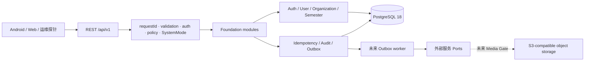
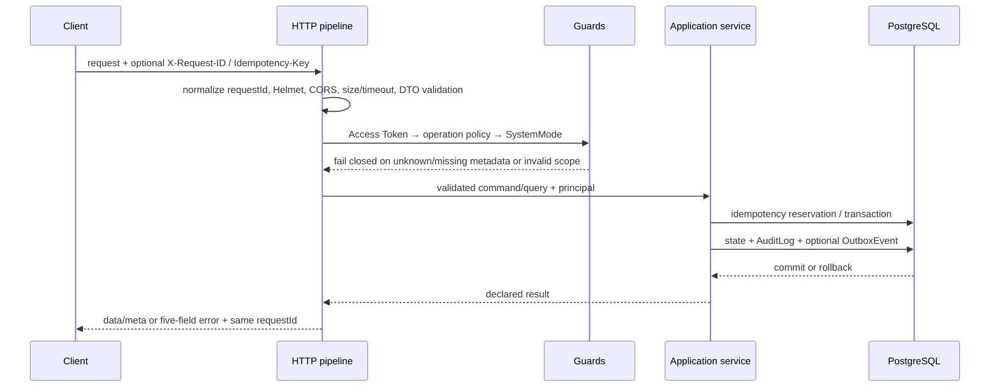

# Greenfield Foundation 架构

## Stage 19 Profile、Audit 与 Export 边界

Student/Teacher read model 继续复用 User/Profile/Enrollment/ClassSection 权威关系，不引入第二套身份或权限中间件。ADMIN 可在本组织读取学生与教师；TEACHER 只能读取本人 ACTIVE ClassSection 学生与本人教师档案；STUDENT 只能读取本人及 ACTIVE Enrollment 责任教师。所有列表 cursor 都绑定组织、主体、角色、过滤、排序与 limit。

原始 AuditLog 只允许同组织 ADMIN 读取。list/get 在事务中先确定查询 snapshot，再追加 `AUDIT_LOG_READ`；投影对 `safeMetadata` 执行 action 白名单与递归脱敏，不能扫描任意 JSON。AuditLog 仍由数据库 trigger 保持 append-only。

Export 当前是明确的禁止边界而非业务模块：四个合同路由经过认证和 Policy 后返回 `SYSTEM_MODE_UNSUPPORTED`。没有 Export persistence、worker、artifact adapter 或 public/signed URL。Backend Operation Coverage 已闭合不等于 Export Business 或 Production 就绪。

## Stage 18 Score 架构增量

Score 是 Review 下游的独立可追溯聚合。`StudentScore` 只保存 current working / published revision 指针；`StudentScoreRevision` 与 `ScoreContribution` 保存不可变计算事实，Contribution 绑定 Record、当前 VALID Review 和 ScoreRule version。规范化 `sourceFingerprint` 使 Review Outbox 重放、手工重算与重复输入收敛，但输入变化会创建新的 working revision。

V1 公式固定使用 Decimal：72000 秒线性映射到 100.00，仅最终一步 HALF_UP 两位，71999 秒固定为 99.99。Rule 激活需要两个不同 ACTIVE ADMIN 且创建者不得自批。Review reopen/INVALID 只改变 working revision；已发布 revision 不被静默覆盖，责任教师必须显式 republish。Adjustment 是追加式最终分数申请/审批，不能改写历史 Review、Contribution 或 revision。

所有 mutation 继续复用 PolicyEngine、SystemMode、Idempotency、expectedVersion、PostgreSQL transaction、AuditLog 与 Outbox。学生只见 published projection；Teacher 仅本人 ClassSection；ADMIN 仅本组织治理且不代行教师。Archived correction 真实 default deny，Export 未实现。Docker runtime Gate 因当前主机缺少 Docker CLI/Desktop 尚未闭合，详见 Stage 18 报告。

## 1. 模块化单体

首个部署单元是一个 ESM NestJS 模块化单体。模块共享一个 PostgreSQL 实例，但通过 application service 和明确 Port 协作；不得绕过模块边界，把其他模块的表当作内部 API。



当前没有微服务、Kafka、RabbitMQ 或强制 Redis。少数 append-only 事实不构成完整 Event Sourcing。

## 2. 分层

| 层                | 当前职责                                        | 禁止事项                                   |
| ----------------- | ----------------------------------------------- | ------------------------------------------ |
| HTTP              | Controller、DTO、输入校验、envelope、状态码     | 在 Controller 编造业务默认值或直接执行 SQL |
| Application       | Auth、授权资源解析、系统模式、事务用例          | 绕过 policy 或依赖客户端角色判断           |
| Domain/Foundation | Clock、ID、错误、状态与端口语义                 | 从 Android DTO/Web Mock 反推权威模型       |
| Infrastructure    | Prisma、PostgreSQL、Argon2id、JOSE、日志        | 在业务事务内直接调用外部服务               |
| Generated         | Prisma Client、OpenAPI document/policy metadata | 手工修改为第二套合同                       |

## 3. 请求生命周期



执行顺序由全局 guard/interceptor/filter 固定。公共 operation 也必须有显式 policy；未知 policyId、resolver、role、scope 或缺失 metadata 均默认拒绝。错误响应固定为 `code/message/details/requestId/timestamp`，成功响应只允许 `data` 和可选 `meta`。

## 4. 事务边界

- 一个需要跨 Foundation 表保持一致的用例在同一 PostgreSQL 事务内完成。
- 业务事实、AuditLog 和需要异步处理的 OutboxEvent 应在同一事务写入。
- 外部 I/O 不得夹在不可恢复的数据库事务内；Roster upload 先写私有临时对象，再提交 durable `RECEIVED`、staged idempotency 和 Outbox，随后进入终态 validation，失败可恢复并安全清理。其他不可逆后处理仍须由提交后的 Outbox consumer 执行。
- 数据库冲突按可识别的 Prisma/PostgreSQL 错误重试；未知错误不吞掉、不假成功。
- 应用启动不自动执行 migration；部署者先运行独立 migrator。

当前 Foundation 只交付 Outbox 持久化与 `FOR UPDATE SKIP LOCKED` 并发领取服务，没有假装存在生产 worker、broker 或告警链路。

## 5. Authentication

- 密码登录只面向已经预配、ACTIVE 且邮件已验证的 TEACHER/ADMIN；STUDENT 不使用密码登录，只能通过 Stage 12 的一次性 QR Join 原子建立无密码身份、Enrollment 与 AuthSession。
- 密码使用 Argon2id；日志、审计与响应不得包含密码或 hash。
- Access Token 使用 Ed25519 私钥签名与 JOSE `EdDSA`，严格校验算法、signature、issuer、audience、expiry 和最小 claims。
- claims 只包含 `sub`、`organizationId`、`role`、`sessionId`、`jti`、`tokenVersion`、`iat`、`exp`、`iss`、`aud`。
- Refresh Token 是高熵 opaque 值，数据库只存 HMAC 摘要；每次 refresh 原子轮换。
- 已消费 token 再次出现会触发 reuse detection，并撤销同一 session/token family。
- logout 撤销服务端 session；已撤销、过期、跨组织或签名异常凭证均拒绝。

Production 仍缺获批 TTL 数值、托管密钥、轮换、`kid`/多密钥过渡、撤销传播 SLO 和 Web Refresh transport。Foundation 的 local/test 配置不能直接用于生产。

## 6. Authorization 与 SystemMode

`docs/backend-contracts/openapi.yaml` 的每个 operation 都有唯一 `x-access-policy`。生成器把当前 88 个 operation 映射为运行时 metadata；合同检查要求 permission matrix 双向 diff 为 0。

授权至少同时判断：

1. operation 的 authentication 类型；
2. 基础 role；
3. principal organization；
4. resource scope/resolver；
5. `defaultDeny=true`；
6. 数据库中的 SystemMode。

`READ_ONLY` 拒绝 mutation，`MAINTENANCE` 只允许合同显式声明的维护期安全 operation。SystemMode 来源固定为数据库，未知枚举或读取失败不会回落为 `NORMAL`。

## 7. Idempotency

- scope、principal、HTTP method、规范化 path 和 canonical JSON body 共同形成 HMAC request hash。
- 相同 key 与相同请求可重放已完成结果；相同 key 对不同请求返回稳定冲突。
- PostgreSQL 唯一约束和 lease 负责跨请求并发预留。
- 响应快照使用 AES-256-GCM 加密后落库，避免把敏感正文当普通 JSON 保存。
- 状态只允许 `IN_PROGRESS/COMPLETED/RETRYABLE_FAILURE`。

retention、lease 和清理责任的 production 数值仍由 ADR-070 阻塞；当前实现不自行编造生产参数。

## 8. Audit 与日志

AuditLog 是不可由普通业务 API 更新/删除的安全事实，migration 用数据库触发器阻止变更。写入只接受字段 allowlist；`permissionId` 必填，source facts 使用 HMAC 摘要，不保存原始幂等 key、Token、密码、完整联系方式或异常堆栈。

应用日志为 JSON，统一携带 requestId 并执行字段/正文脱敏。AuditLog 与可观测日志用途不同；生产保留、访问审批、导出、告警和 on-call 责任仍未获批准。

## 9. 数据库与对象存储

PostgreSQL 18 是 Foundation 唯一持久化系统。Prisma 表达常规关系，受版本控制的 SQL migration 补充命名 CHECK、partial unique、函数/触发器和索引。详见 [`database-baseline.md`](database-baseline.md)。

对象存储冻结 S3-compatible Port 边界。Stage 13 的 Roster FILE source 使用 private bucket、`roster-sources/*` 最小权限身份；Stage 15 的 MediaEvidence 使用独立 private bucket、独立 identity、`media/*` namespace 和独立 adapter。Media signed upload/access URL 只在敏感 no-store 响应中返回，storageKey 不进入公共 projection、AuditLog、Outbox 或普通日志。当前 local scanner 只用于确定性验证；production scanning、retention、cleanup 和供应商仍未批准。

## 10. 后续模块顺序

当前已完成 Course/ClassSection、Enrollment/一次性 QR Join、Roster、ExerciseSession、MediaEvidence 与 ExerciseRecord Core；下一阶段是 Review，随后才是 Score → Export → 多端迁移与 production。Roster Ignore、Enrollment withdraw 与 ExerciseRecord withdraw 仍为真实 default deny。每个模块必须先关闭对应 ADR、更新唯一 OpenAPI、补数据库/权限/安全测试，再打开 Gate。

单进程 Foundation 登录限流目前通过 in-memory adapter 实现，仅适用于 local/test 和单实例验证。任何多实例或生产部署必须先选择共享 adapter，并完成故障、容量和告警验收。

## 11. 阶段 11：Course 与 ClassSection

教学结构继续使用同一 ESM 模块化单体，不建立第二套 API、权限、幂等或数据库事实：

```text
Organization
  ├─ Course（组织级、跨学期复用目录）
  ├─ Semester
  └─ TeacherProfile
       └─ ClassSection（Course + Semester + 单一责任 Teacher）
            └─ ClassSectionExcludedDate（整体值对象集合，无独立公共 API）
```

`courses/` 与 `class-sections/` 都按 `domain/application/infrastructure/interface/http` 分层。Domain 只持有 entity/value object/invariant/repository port/projection，不依赖 NestJS、Prisma、Express 或客户端 DTO；Prisma adapter 负责 tenant-safe 查询、乐观锁和数据库错误映射。

Course 写操作由 ADMIN 在 principal Organization 内完成。TEACHER 只能读取 ACTIVE Course；STUDENT 在 Enrollment 关系实现前稳定拒绝，不返回全量目录或假空列表。ClassSection 写操作由 TEACHER 完成，责任 `teacherId` 由 principal 的 ACTIVE TeacherProfile 推导；ADMIN 只有本组织治理读取权，不能代行教学操作。

Course/ClassSection mutation 复用共享执行链：policy/SystemMode/DTO → Idempotency 预留 → resource/version invariant → PostgreSQL transaction → business row/ExcludedDates → AuditLog → Outbox → idempotency completion。ExcludedDates 替换先锁定 ClassSection，再在同一事务整体删除/重建；任何日期、版本、审计或 Outbox 失败都会整体回滚。

Course、Semester、TeacherProfile、actor 与 ClassSection 的 Organization 一致性同时由复合 FK、repository organization predicate 和 application invariant 保证。普通更新不接受 `organizationId/courseId/semesterId/teacherId`。Course 停用只阻止新开班；ClassSection 关闭/归档保留历史且拒绝普通写。

列表使用 opaque cursor，签名绑定 resource、Organization、principal、role/teacher scope、filters、sort、limit 和 schema version，并以 ID 作为稳定 tie-breaker。跨教师、跨组织、修改 filter/sort/limit 或未知查询字段都 fail closed；响应不伪造 `totalCount`。

运行覆盖账本由 OpenAPI 和 manifest 确定性生成。本节是阶段 11 历史快照；阶段 12 完成后，86 个 operation 中 28 个为 `IMPLEMENTED_VERIFIED`、1 个为 `IMPLEMENTED_DEFAULT_DENY`、51 个为 `NOT_IMPLEMENTED`、6 个为 `BLOCKED_BY_ADR`。

## 12. 阶段 12：学生身份、Enrollment 与 QR Join

Stage 12 继续使用同一模块化单体与共享 Foundation 执行链：

```text
Course + Semester + TeacherProfile
              │
        ClassSection
          ├─ CourseInvite（轮换保留历史，长期仅存 token HMAC）
          ├─ JoinCapability（身份与班级绑定、短期、一次性）
          └─ Enrollment（同班永久唯一、同学期 ACTIVE 唯一）
               └─ EnrollmentStatusEvent（append-only 生命周期事实）
```

公开二维码流程分为 preview → issue capability → atomic join。普通 `Authorization` 不能代替 `X-Join-Capability`。Capability 的 identity snapshot 与首次成功结果分别使用用途绑定的 AES-256-GCM escrow；通用 IdempotencyRecord 只保存不敏感引用。相同 capability、identity fingerprint、operation 和 Idempotency-Key 可在短窗口内精确重放；新的 key 消费已使用 capability 时稳定拒绝。

QR Join 使用 Serializable PostgreSQL 事务：重新校验 invite、Course/ClassSection、Semester、公开加入开关与 capability；创建或严格复用 organization 内按规范化 `studentNumber` 唯一的无密码 STUDENT User/StudentProfile；校验同学期 ACTIVE 唯一；创建 Enrollment/status event、AuthSession/RefreshToken、AuditLog、Outbox；最后消费 capability 并保存专用结果 escrow。任一步冲突或失败全部回滚，不产生半身份、半 Enrollment 或额外 Session。

Teacher 手工添加只接受既有 ACTIVE StudentProfile，按本人 ClassSection scope 执行；remove/restore 复用同一 enrollmentId 和 expectedVersion。ADMIN 仅本组织只读，STUDENT 仅本人读。withdraw route 真实经过认证、资源 scope 和 DTO 校验后按 ADR-054 返回 `ENROLLMENT_WITHDRAWAL_DISABLED`，不写状态事件、成功审计或业务 Outbox；学生自行 rejoin 同样未开放。

## 13. 阶段 14：ExerciseSession 权威计时

ExerciseSession 模块继续复用统一请求链与 PostgreSQL 事务边界。Start 从本人 ACTIVE Enrollment、ClassSection 时间窗、组织时区和服务端当前时间建立唯一非终态 Session；partial unique index 与 serializable transaction 同时防止双设备并发创建。

Session 当前事实保存在 `exercise_sessions`，服务端确认的 RUNNING/PAUSED 区间保存在 `exercise_session_segments`，所有状态与 reconcile 证据保存在 append-only `exercise_session_events`。状态变更、segment、事件、AuditLog、Outbox 与幂等完成在同一事务中提交。`actualDurationSeconds` 只累计确认的 RUNNING 区间，暂停单独累计，7200 秒时物化为 COMPLETED。

Reconcile 只接受启动该 Session 的 authSession 所提交的有序、非未来 `STATE_SYNC` 观察；它记录证据但不把未验证离线区间变成权威时长。当前没有自动 EXPIRED worker、Session list、Media 或 Record 表。Teacher/Admin 在 OpenAPI 没有 Session operation，因此保持默认拒绝，不发明只读投影。

## 14. 阶段 15：MediaEvidence 私有证据链

MediaEvidence 以稳定 `mediaId` 为聚合根，上传 capability 由独立 `uploadSessionId` 表达。数据库分别保存客户端 declared 与服务端 verified MIME/size/hash/duration；confirm 通过 MediaStoragePort HEAD + 流式读取对象正文进行完整性判断，ETag 不承担 hash 事实。

Media 当前表携带 Organization、owner Student、Enrollment、ClassSection、Semester 与 ExerciseSession 复合范围。Stage 15 bind 只允许原 Session，不保存无 FK 的未来 Record ID。数据库 quota trigger 在事务 advisory lock 下限制每 Session/purpose 活跃 6 IMAGE + 1 VIDEO，避免并发绕过。

处理 worker 从数据库领取 BOUND/PROCESSING 行，持久化 attempt，并在事务内追加状态事件、AuditLog 与 Outbox；崩溃或重启不会依赖进程内 Map。AVAILABLE 后仅本人可获得短期只读 URL；责任 Teacher 仅 metadata，ADMIN 不在当前 role contract 中。ExerciseRecord 冻结关联、Review 父关系、retention/delete 和 production scanning 均留给后续 Gate。

## 15. 阶段 16：ExerciseRecord 权威提交

ExerciseRecord 是与 ExerciseSession 分离的正式提交聚合。本人 COMPLETED Session 只能创建一个 Record；DRAFT 接受白名单内容更新和 expectedVersion，但 organization/student/enrollment/status/权威时长/review result 全由服务器从资源链推导。正式信用按权威 Session 时长确定：不足 3600 秒拒绝，3600..7199 秒为 3600，达到 7200 秒为 7200。

Submit 在同一 PostgreSQL 事务中先锁定 Enrollment，再锁定 Record 与 Media，校验 AVAILABLE、同 owner/Session、`EXERCISE_RECORD` purpose 和 1..6 IMAGE/0..1 VIDEO，建立 FK 保护的冻结关联与永久每日槽位，追加 Record event、AuditLog、Outbox 和幂等结果，并创建初始 PENDING ReviewRecord。共享 IdempotencyService 对 Prisma `P2034` 及 driver adapter 包装的 PostgreSQL `40001` 执行最多三次的有界全事务重试；任何一次未完成的尝试都整体回滚，Record 不会进入半提交状态。

Stage 16 只建立 Review 父关系与安全 `currentReview` 投影，不实现教师决策。学生永不收到 `internalNote`、teacher identity 或 storageKey。下一阶段 Review 继续采用 append-only ReviewRecord、责任教师 scope 与双版本并发；不得恢复 claim-review 或可写 UNDER_REVIEW。

## 16. 阶段 17：append-only Review 决策

ExerciseReview 模块继续复用统一 PolicyEngine、SystemMode、幂等、PostgreSQL transaction、AuditLog 与 Outbox。责任教师 scope 由 Record → ClassSection → TeacherProfile → principal user 的持久关系解析；请求体中的 teacher/organization/student 字段不能扩大权限。ADMIN、STUDENT、跨教师与跨组织 mutation 均 fail closed。

Review decision 在锁定 Record 后读取最高 reviewVersion，同时校验 Record 与 Review 两个 expected version。新 ReviewRecord、Record 状态/version、ExerciseRecordEvent、AuditLog、Outbox 和幂等完成在同一事务提交；数据库触发器要求 previousReviewId 恰好指向同 Record 的紧邻上一版本。Reopen 只追加 PENDING，不覆盖历史。

Batch 使用持久化外层重放结果，并为每个 item 调用相同的单项 mutation 事务，因此一项失败不会撤销其他成功项，也不会扩大其他项的资源权限。Stage 17 不改变 Session/Record 时长、Media verified facts 或冻结关联，也不派生成绩。Score/Export 继续是独立 Gate。

## 17. 阶段 18：Score Core 与 Docker 运行闭环

Score 采用 `ScoreRule → StudentScore → immutable StudentScoreRevision → ScoreContribution` 的可追溯模型。Rule 需要两名不同 ACTIVE ADMIN 审批激活；current VALID Review 才贡献，reopen/INVALID 只生成新的 working revision，不覆盖 published pointer。学生只读取 published projection，责任教师必须显式 publish/republish。ScoreAdjustment 是追加式申请与审批历史，不修改旧 revision；archived correction 保持真实 default deny。

Stage 18V 在 monorepo clean 基线上完成真实容器验收：App 与 Migrator 使用分离数据库身份，App UID 10001 且无 schema CREATE；PostgreSQL 18.4 与 private MinIO 均健康，0001–0009 首次/重复部署与 drift 0；HTTP、worker、数据库事实共同闭合 Media→Record→Review→Score→Publication→Adjustment。App/PostgreSQL/MinIO restart 和持久性、production fail-fast、CORS、日志脱敏、teardown 均通过。Score Core Gate 为“是”，但 Export、Client Integration、Historical Data Migration 与 Full Production Gate 仍为“否”。
