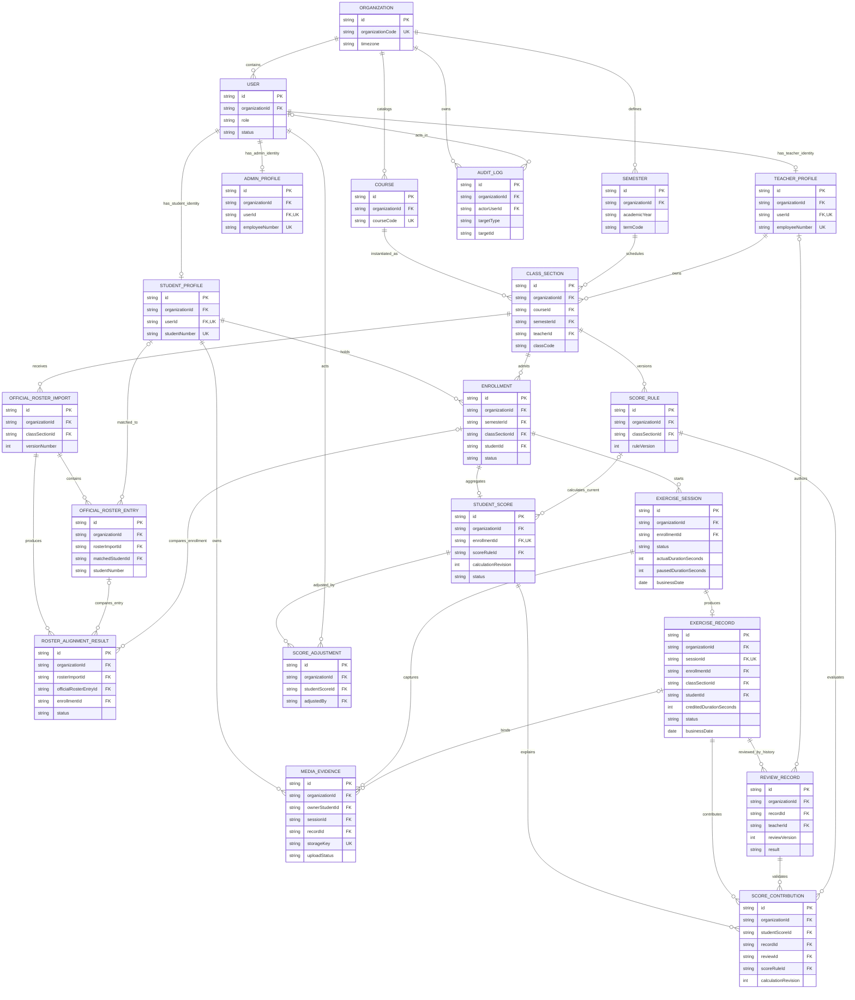

# 体育打卡统一领域模型

> 状态：阶段 1 统一契约基线。本文只定义业务对象、职责、关系和不变量；不定义正式 API，不代表数据库已经存在，也不授权执行迁移。
>
> 依据：`00-current-state-audit.md`、`conflict-matrix.md`、`decision-log.md`、三端业务流程文档及当前 Android/Web 源码。发生冲突时，以 `decision-log.md` 中 `ACCEPTED` 决策和本轮阶段指令为先。
> 命名：本文使用 API 逻辑名（camelCase）；未来数据库名按 ADR-003 转为 snake_case。所有 `id`、`...Id` 都是不可解释的内部字符串 ID，`studentNumber`、`employeeNumber` 等学校编号绝不充当主键（ADR-004）。外键按目标业务实体使用 `studentId`、`teacherId`、`sessionId`、`recordId`、`enrollmentId`，分别引用对应 Profile/Session/Record/Enrollment 的内部 `id`。

## 1. 领域边界

### 1.1 当前租户边界

当前只有一个 BNBU 组织，但不是“无租户”系统。`Organization` 是所有核心数据的租户边界；除明确的系统级技术配置外，本文每个持久化对象都直接携带 `organizationId`。任何读取或修改必须先校验组织一致，再校验本人、教学班归属和对象状态（ADR-013、ADR-014）。不得通过姓名、前端路由或客户端传入的角色推断归属。

### 1.2 子域划分

| 子域 | 包含对象 | 边界职责 |
|---|---|---|
| 组织与身份 | `Organization`、`User`、`StudentProfile`、`TeacherProfile`、`AdminProfile` | 认证主体与学校身份分离；联系方式、账号状态不塞进入班关系 |
| 教学结构 | `Semester`、`Course`、`ClassSection`、`Enrollment` | 课程定义、学期开课实例和学生实际入班关系分离 |
| 官方名单 | `OfficialRosterImport`、`OfficialRosterEntry`、`RosterAlignmentRun`、`RosterAlignmentPlatformEntry`、`RosterAlignmentResult`、`RosterResolutionEvent` | 保存官方快照、逐行事实、冻结的平台成员快照、不可变对齐结果和追加式处置历史；不通过名单直接改写身份或入班事实 |
| 运动打卡 | `ExerciseSession`、`ExerciseRecord`、`MediaEvidence`、`ReviewRecord` | 计时、正式提交、文件生命周期和审核历史分别建模 |
| 成绩 | `ScoreRule`、`StudentScore`、`ScoreAdjustment`、支持实体 `ScoreContribution` | 版本化规则、当前聚合、人工调整及每次计算来源分别建模 |
| 审计 | `AuditLog` | 记录谁在何时对什么对象做了什么；不替代领域历史 |

### 1.3 本阶段不纳入核心模型的相邻能力

课程邀请凭证、验证码/密码凭据、Refresh Token/设备会话、通知、免测申请、校队/社团认证、帮助文章、工单和系统维护属于相邻子域。当前代码中的这些数据必须保留兼容，但在职责、状态和权限尚未冻结前，不强塞进本文 20 个核心对象。其对成绩产生的最终影响只能通过可追溯的 `ScoreAdjustment`（以及独立凭证引用）进入 `StudentScore`，不能伪装成学生运动 `ExerciseRecord`。

## 2. 全局建模不变量

1. `User`、各 Profile、`Enrollment` 是不同对象；账号 ID、Profile ID、Enrollment ID 和学校编号四者不得互换。
2. `Course` 是跨学期课程定义；`ClassSection` 是某学期的具体教学班。教师、班号、时间窗和学期只能属于 `ClassSection`。
3. `OfficialRosterEntry` 是外部官方快照行，`Enrollment` 是平台实际成员关系；对齐异常不得改写任一原始事实。
4. `ExerciseSession` 是服务端校验的计时过程，`ExerciseRecord` 是提交、审核和计分对象；一个 Session 最多产生一个 Record。
5. `MediaEvidence` 有独立上传/处理/绑定生命周期；Record 只通过 `mediaId` 关系引用，绝不保存 URL、文件名数组或二进制文本字段。
6. `ReviewRecord` 只追加、不覆盖。Record 流程状态与 `ReviewResult` 是两个维度；当前审核结果由最高 `reviewVersion` 推导。
7. `StudentScore` 是派生聚合，不是原始事实。基础计算必须通过 `ScoreContribution` 追到 `VALID` Review、对应 Record 和 ScoreRule；最终值如含人工改变，还必须追到 `ScoreAdjustment`。
8. 事实时长一律为整数秒：`actualDurationSeconds`、`pausedDurationSeconds`、`creditedDurationSeconds` 含义不同，不得再使用模糊 `duration` 或把小时小数作为事实。
9. `businessDate` 由后端按组织时区和 Session 的 `startedAt` 计算（ADR-037）；客户端日期不具权威性。
10. 核心事实不做普通物理删除。是否最终清理须等待 ADR-023、ADR-024、ADR-032、ADR-040；软删除字段不能被用来绕过归档、撤销或历史保留。

## 3. 核心对象清单

| # | 中文名称 | 英文名称 | 类型 | 主职责 |
|---:|---|---|---|---|
| 1 | 用户账户 | `User` | 核心实体/聚合根 | 登录、角色、联系方式和账户状态 |
| 2 | 学生档案 | `StudentProfile` | 核心实体/聚合根 | 学校学生身份 |
| 3 | 教师档案 | `TeacherProfile` | 核心实体/聚合根 | 学校教师身份 |
| 4 | 管理员档案 | `AdminProfile` | 核心实体/聚合根 | 管理人员身份，不承载教学权限 |
| 5 | 组织 | `Organization` | 核心实体/聚合根 | 数据租户和时区边界 |
| 6 | 学期 | `Semester` | 核心实体/聚合根 | 教学时间周期 |
| 7 | 课程 | `Course` | 核心实体/聚合根 | 跨学期课程定义 |
| 8 | 教学班 | `ClassSection` | 核心实体/聚合根 | 某学期的具体开课实例 |
| 9 | 入班关系 | `Enrollment` | 核心实体/聚合根 | 学生与教学班的实际关系 |
| 10 | 官方名单导入 | `OfficialRosterImport` | 核心实体/聚合根 | 一次官方名单导入及版本 |
| 11 | 官方名单条目 | `OfficialRosterEntry` | 核心实体 | 导入文件中的单行官方事实 |
| 12 | 名单对齐结果 | `RosterAlignmentResult` | 核心实体/聚合根 | 官方条目与平台入班关系的比较事实 |
| 13 | 运动计时过程 | `ExerciseSession` | 核心实体/聚合根 | 一次开始、暂停、继续、结束的计时 |
| 14 | 打卡记录 | `ExerciseRecord` | 核心实体/聚合根 | 学生最终提交并接受审核/计分的记录 |
| 15 | 媒体凭证 | `MediaEvidence` | 核心实体/聚合根 | 图片/视频上传、处理、绑定和访问控制 |
| 16 | 审核记录 | `ReviewRecord` | 核心事实实体 | 每次审核决定及其历史链 |
| 17 | 成绩规则 | `ScoreRule` | 核心实体/聚合根 | 可版本化的目标和计算规则快照 |
| 18 | 学生成绩 | `StudentScore` | 核心实体/聚合根 | Enrollment 当前累计时长和成绩结果 |
| 19 | 成绩调整 | `ScoreAdjustment` | 核心事实实体 | 人工改变前后值、理由和授权来源 |
| 20 | 审计日志 | `AuditLog` | 核心基础事实 | 关键命令的不可变操作日志 |
| 21 | 成绩来源项 | `ScoreContribution` | 必要支持实体 | 把一次计算修订逐项连到 Record、Review 和 Rule |

第 21 个对象不是新的业务入口，而是满足“所有成绩可追溯”的最小关联事实；若没有它，只能在 `StudentScore` 中存 ID 数组或不可验证的摘要，都会破坏关系完整性。

## 4. 对象职责与数据治理

下文“学生客户端”指现有 Android，以及目标态但当前缺少源码的 iOS/Web 学生端；“教师 Web/管理 Web”均指当前原型及未来真实接入版本。列出可读不等于当前已经有真实后端接口。

### 4.1 用户账户 / User

| 项目 | 定义 |
|---|---|
| 中文名称 / 英文名称 | 用户账户 / `User` |
| 业务职责 | 唯一认证主体；保存基础角色、账号状态、已验证联系方式和认证版本，不保存学生入班或教学班数据 |
| 是否核心实体 | 是，身份子域聚合根 |
| 唯一标识 | `id`（opaque string）；学校编号不是 User ID |
| 所属组织范围 | 必须有 `organizationId`；一个 User 只属于一个组织 |
| 主要字段概览 | `id`、`organizationId`、`role`、`status`、`primaryEmail`、`primaryPhone`、`emailVerifiedAt`、`phoneVerifiedAt`、`passwordHash`、`tokenVersion`、`createdAt`、`updatedAt`、`deletedAt`、`version` |
| 与其他对象关系 | 与恰好一种角色 Profile 一对零或一；作为创建者、调整者、导入者、审计 actor 被其他对象引用 |
| 创建来源 | 学生扫码直加入班事务；教师/管理员受控开户；学校系统同步 |
| 生命周期 | 创建/待完成联系方式 → 可用 → 禁用或恢复中 → 按获批保留策略注销；具体认证状态在后续状态/安全阶段冻结 |
| 是否允许软删除 | 有限允许；先禁用，只有获批数据生命周期流程可写 `deletedAt`，不得级联删除领域事实 |
| 是否需要审计 | 是；创建、联系方式变更、角色/状态、凭据版本、注销均审计 |
| 数据所有者 | `Organization`；个人是数据主体，认证服务是维护者 |
| 哪些客户端可以读取 | 学生客户端只读本人最小投影；教师 Web 只读本人；管理 Web 按权限读组织内账户；不得跨组织 |
| 哪些角色可以修改 | 本人仅修改允许的联系方式；`ADMIN` 管理账户状态；认证服务修改凭据字段；任何角色都不能借此改 Enrollment |

### 4.2 学生档案 / StudentProfile

| 项目 | 定义 |
|---|---|
| 中文名称 / 英文名称 | 学生档案 / `StudentProfile` |
| 业务职责 | 保存学校学生身份；提供稳定 `studentNumber` 用于组织内匹配，但所有业务外键仍指内部 `id` |
| 是否核心实体 | 是，身份子域聚合根 |
| 唯一标识 | `id`；`userId` 一对一唯一；`(organizationId, studentNumber)` 业务唯一 |
| 所属组织范围 | `organizationId`，且必须与 User/Enrollment 相同 |
| 主要字段概览 | `id`、`organizationId`、`userId`、`studentNumber`、`fullName`、`gender`、`gradeYear`、`collegeName`、`majorName`、`administrativeClassName`、`status`、`createdAt`、`updatedAt`、`deletedAt`、`version` |
| 与其他对象关系 | 一个 StudentProfile 有多个历史 Enrollment；可被多个官方名单版本条目匹配；通过 Enrollment 拥有 Session、Record 和 Score |
| 创建来源 | 扫码直加入班事务按学号查找或创建；受控官方同步/管理员导入 |
| 生命周期 | 建档 → 有效 → 学籍停用/毕业后只读保留；不随退课删除 |
| 是否允许软删除 | 有限允许且不能有未处理引用；通常使用 `status` 停用 |
| 是否需要审计 | 是；学号和身份字段变更尤其需要 |
| 数据所有者 | `Organization` 学籍域；学生为数据主体 |
| 哪些客户端可以读取 | 学生客户端本人；教师 Web 仅本人教学班学生的必要字段；管理 Web 按账户权限；名单对齐仅读匹配所需字段 |
| 哪些角色可以修改 | 学生只能修改被允许的非权威资料；`ADMIN`/学校同步维护权威身份；教师不能修改学生档案 |

### 4.3 教师档案 / TeacherProfile

| 项目 | 定义 |
|---|---|
| 中文名称 / 英文名称 | 教师档案 / `TeacherProfile` |
| 业务职责 | 保存教师学校身份，作为教学班责任人和审核人引用；不保存账号凭据 |
| 是否核心实体 | 是，身份子域聚合根 |
| 唯一标识 | `id`；`userId` 唯一；非空时 `(organizationId, employeeNumber)` 唯一 |
| 所属组织范围 | `organizationId` |
| 主要字段概览 | `id`、`organizationId`、`userId`、`employeeNumber`、`fullName`、`collegeName`、`departmentName`、`title`、`status`、`createdAt`、`updatedAt`、`deletedAt`、`version` |
| 与其他对象关系 | 负责多个 ClassSection；创建/处理名单导入；作为 ReviewRecord reviewer；可发起 ScoreAdjustment |
| 创建来源 | 管理员受控开户或学校人事同步 |
| 生命周期 | 建档 → 有效任教 → 停用/离职后只读保留；停用不改变历史审核者 |
| 是否允许软删除 | 有限允许；有历史教学事实时仅停用 |
| 是否需要审计 | 是 |
| 数据所有者 | `Organization` 人事/教学管理域 |
| 哪些客户端可以读取 | 教师 Web 本人；学生客户端仅所属教学班教师公开信息；管理 Web 按权限 |
| 哪些角色可以修改 | 本人仅可改允许的公开资料；`ADMIN`/人事同步维护权威字段；教师不能自授予教学班 |

### 4.4 管理员档案 / AdminProfile

| 项目 | 定义 |
|---|---|
| 中文名称 / 英文名称 | 管理员档案 / `AdminProfile` |
| 业务职责 | 保存管理人员身份和组织归属；具体权限由后续授权模型决定，不在 Profile 内硬编码教学能力 |
| 是否核心实体 | 是，身份子域聚合根 |
| 唯一标识 | `id`；`userId` 唯一；非空时 `(organizationId, employeeNumber)` 唯一 |
| 所属组织范围 | `organizationId` |
| 主要字段概览 | `id`、`organizationId`、`userId`、`employeeNumber`、`fullName`、`departmentName`、`status`、`createdAt`、`updatedAt`、`deletedAt`、`version` |
| 与其他对象关系 | 通过 User 成为 Semester、账户、规则和系统操作的 actor；不直接成为 ClassSection 教师 |
| 创建来源 | 超级管理员/受控运维开户或学校人事同步 |
| 生命周期 | 建档 → 有效 → 停用；职责交接不改历史 actor |
| 是否允许软删除 | 有限允许，优先停用 |
| 是否需要审计 | 是，含授权变更和停用 |
| 数据所有者 | `Organization` 管理域 |
| 哪些客户端可以读取 | 管理 Web 本人和经授权的管理员；其他客户端不读取管理员档案 |
| 哪些角色可以修改 | 仅受授权的 `ADMIN`/身份同步；不得由教师或学生修改 |

### 4.5 组织 / Organization

| 项目 | 定义 |
|---|---|
| 中文名称 / 英文名称 | 组织 / `Organization` |
| 业务职责 | 定义租户、法律/显示名称、默认时区和数据隔离边界 |
| 是否核心实体 | 是，顶层聚合根 |
| 唯一标识 | `id`；`organizationCode` 全局唯一 |
| 所属组织范围 | 自身；当前唯一实例为 BNBU |
| 主要字段概览 | `id`、`organizationCode`、`legalName`、`displayName`、`timezone`、`defaultLocale`、`status`、`createdAt`、`updatedAt`、`version` |
| 与其他对象关系 | 一对多拥有本文所有其他对象 |
| 创建来源 | 系统初始化/受控租户开通，不由普通客户端创建 |
| 生命周期 | 初始化 → 有效 → 停用；停用时全组织业务写入关闭 |
| 是否允许软删除 | 否；只允许停用并保留全量引用 |
| 是否需要审计 | 是 |
| 数据所有者 | 学校/机构自身 |
| 哪些客户端可以读取 | 全部客户端可读必要显示信息及时区；管理 Web 可读管理投影 |
| 哪些角色可以修改 | 仅平台级受控运维或最高授权管理员；普通 `ADMIN` 不当然拥有此权利 |

### 4.6 学期 / Semester

| 项目 | 定义 |
|---|---|
| 中文名称 / 英文名称 | 学期 / `Semester` |
| 业务职责 | 定义教学日期范围和归档边界，不承载具体课程、教师或成绩字段 |
| 是否核心实体 | 是，教学结构聚合根 |
| 唯一标识 | `id`；`(organizationId, academicYear, termCode)` 唯一 |
| 所属组织范围 | `organizationId` |
| 主要字段概览 | `id`、`organizationId`、`academicYear`、`termCode`、`displayName`、`startDate`、`endDate`、`status`、`createdBy`、`createdAt`、`updatedAt`、`version` |
| 与其他对象关系 | 一个 Semester 有多个 ClassSection；Enrollment 冗余携带 `semesterId` 仅用于强约束且必须与 ClassSection 一致 |
| 创建来源 | 管理 Web 的学期管理命令 |
| 生命周期 | `UPCOMING` → `CURRENT` → `ARCHIVED`；切换是否自动归档旧学期待 ADR-027 |
| 是否允许软删除 | 否；未使用草稿的删除策略也必须先形成明确规则 |
| 是否需要审计 | 是，特别是 current 切换和归档 |
| 数据所有者 | `Organization` 教学管理域 |
| 哪些客户端可以读取 | 全部客户端读相关学期；管理 Web 读全部 |
| 哪些角色可以修改 | `ADMIN`；教师/学生不可修改 |

### 4.7 课程 / Course

| 项目 | 定义 |
|---|---|
| 中文名称 / 英文名称 | 课程 / `Course` |
| 业务职责 | 定义跨学期复用的课程代码、名称和说明；不包含 section、semester、teacher、名单或进度 |
| 是否核心实体 | 是，教学结构聚合根 |
| 唯一标识 | `id`；`(organizationId, courseCode)` 唯一 |
| 所属组织范围 | `organizationId` |
| 主要字段概览 | `id`、`organizationId`、`courseCode`、`courseName`、`description`、`status`、`createdBy`、`createdAt`、`updatedAt`、`deletedAt`、`version` |
| 与其他对象关系 | 一个 Course 在不同 Semester 下产生多个 ClassSection |
| 创建来源 | 本组织 `ADMIN`；未来获批的教学课程目录同步复用同一 application service |
| 生命周期 | 建立定义 → 有效 → 停用；停用不关闭已有 ClassSection |
| 是否允许软删除 | 仅未被引用时可软删除；被引用后只能停用 |
| 是否需要审计 | 是 |
| 数据所有者 | `Organization` 课程目录域 |
| 哪些客户端可以读取 | `ADMIN` 读本组织目录；`TEACHER` 读本组织 ACTIVE Course；`STUDENT` 仅经本人 ACTIVE Enrollment 读关联投影 |
| 哪些角色可以修改 | 本组织 `ADMIN` 创建、修改和改变 `ACTIVE/INACTIVE`；教师只能创建或维护本人 ClassSection，不能改 Course；学校同步需未来独立 ADR 且复用同一服务 |

### 4.8 教学班 / ClassSection

| 项目 | 定义 |
|---|---|
| 中文名称 / 英文名称 | 教学班 / `ClassSection` |
| 业务职责 | 表示课程在某学期的一次具体开课；承载班号、责任教师、开放状态和打卡时间窗 |
| 是否核心实体 | 是，教学班聚合根 |
| 唯一标识 | `id`；`(semesterId, courseId, classCode)` 唯一，对应旧合同的“学期 + 课程代码 + Section” |
| 所属组织范围 | `organizationId`，并校验 Course/Semester/Teacher 同组织 |
| 主要字段概览 | `id`、`organizationId`、`courseId`、`semesterId`、`classCode`、`displayName`、`teacherId`、`status`、`isEnrollmentOpen`、`checkInWindowMode`、`checkInStartDate`、`checkInEndDate`、`dailyStartTime`、`dailyEndTime`、`submissionDeadlineAt`、`excludedDates`、`createdAt`、`updatedAt`、`version` |
| 与其他对象关系 | 属于一个 Course 和 Semester；由一个责任教师负责；拥有 Enrollment、RosterImport 和 ScoreRule 版本 |
| 创建来源 | 责任教师在 ACTIVE Course 和可写 Semester 下创建；未来教学系统同步需独立 ADR |
| 生命周期 | 计划 → 开放 → 关闭/结束 → 随 Semester 归档只读 |
| 是否允许软删除 | 否；使用关闭/归档，任何历史引用都保留 |
| 是否需要审计 | 是，教师、时间窗、开放状态和规则关联变更均审计 |
| 数据所有者 | `Organization`；责任教师是业务数据 steward，不是租户所有者 |
| 哪些客户端可以读取 | 学生客户端仅本人 Enrollment 对应班；教师 Web 仅本人负责班；管理 Web 按组织治理权限 |
| 哪些角色可以修改 | 责任 `TEACHER` 修改本人班允许的设置；`ADMIN` 管理学期但默认不代行教学操作（ADR-033）；归档后拒绝普通写入（ADR-035） |

### 4.9 入班关系 / Enrollment

| 项目 | 定义 |
|---|---|
| 中文名称 / 英文名称 | 入班关系 / `Enrollment` |
| 业务职责 | 保存学生与教学班的实际成员关系、加入来源和退出/移出生命周期；不是官方名单行，也不是组织/社团 membership |
| 是否核心实体 | 是，独立聚合根 |
| 唯一标识 | `id`；`(classSectionId, studentId)` 永久唯一，一段关系通过状态变化而非重复插行表示 |
| 所属组织范围 | `organizationId`；`semesterId` 为约束投影，必须等于 ClassSection.semesterId |
| 主要字段概览 | `id`、`organizationId`、`semesterId`、`classSectionId`、`studentId`、`source`、`sourceReferenceId`、`status`、`joinedAt`、`endedAt`、`endReason`、`createdBy`、`createdAt`、`updatedAt`、`version` |
| 与其他对象关系 | 属于一个 StudentProfile 和 ClassSection；可被多个 AlignmentResult 观察；拥有 Session、Record 链和至多一个当前 StudentScore |
| 创建来源 | 扫码/邀请码直接加入事务；官方导入、教师手工或系统同步（`source` 分别记录） |
| 生命周期 | 直接创建为 `ACTIVE`；之后可 `WITHDRAWN` 或 `REMOVED`；正常扫码没有 `PENDING_APPROVAL`（ADR-006） |
| 是否允许软删除 | 否；状态结束后保留全部历史 |
| 是否需要审计 | 是，创建、退出、移出、恢复均审计 |
| 数据所有者 | `Organization`/ClassSection；学生是关系参与者 |
| 哪些客户端可以读取 | 学生客户端本人；教师 Web 本人班；管理 Web 按组织权限 |
| 哪些角色可以修改 | `STUDENT` 仅通过受控加入/退出命令；责任 `TEACHER` 可移出本人班成员；`ADMIN` 默认不直接执行教学成员操作 |

额外强约束：同一 `studentId + semesterId` 最多一个 `ACTIVE` Enrollment；并发加入必须在后端事务和数据库约束层共同防重。同一关系重复加入幂等返回既有 Enrollment。

### 4.10 官方名单导入 / OfficialRosterImport

| 项目 | 定义 |
|---|---|
| 中文名称 / 英文名称 | 官方名单导入 / `OfficialRosterImport` |
| 业务职责 | 表示一次文件/API 官方名单导入、解析结果和不可变版本元数据 |
| 是否核心实体 | 是，名单导入聚合根 |
| 唯一标识 | `id`；`(classSectionId, versionNumber)` 唯一；源文件 `contentSha256` 用于重复检测但不是主键 |
| 所属组织范围 | `organizationId` |
| 主要字段概览 | `id`、`organizationId`、`classSectionId`、`versionNumber`、`source`、`fileName`、`sourceFileStorageKey`、`fileChecksumSha256`、`fieldMappingSnapshot`、`status`、`totalRowCount`、`validRowCount`、`invalidRowCount`、`duplicatedRowCount`、`failureCode`、`failureDetailsSafe`、`importedBy`、`importedAt`、`isCurrent`、`supersededAt`、`createdAt`、`version` |
| 与其他对象关系 | 属于一个 ClassSection；包含多个 OfficialRosterEntry；产生多个 AlignmentResult |
| 创建来源 | V1 由责任教师上传严格 UTF-8 CSV；`OFFICIAL_API` 在受信 Connector 合同闭合前稳定拒绝 |
| 生命周期 | 接收 → 解析/校验 → 成功或失败 → 被新版本取代；旧版本不覆盖 |
| 是否允许软删除 | 否；失败和被取代版本仍保留审计所需元数据，源文件保留期待决策 |
| 是否需要审计 | 是 |
| 数据所有者 | `Organization`/ClassSection；责任教师为导入操作者 |
| 哪些客户端可以读取 | 教师 Web 仅本人班；管理 Web 按治理权限；学生客户端不读原始名单 |
| 哪些角色可以修改 | 责任 `TEACHER` 发起新导入；既有成功版本不可修改；系统写解析统计 |

### 4.11 官方名单条目 / OfficialRosterEntry

| 项目 | 定义 |
|---|---|
| 中文名称 / 英文名称 | 官方名单条目 / `OfficialRosterEntry` |
| 业务职责 | 保存某一官方版本的单行原始/规范化学生信息；即使重复或无效也必须可重现 |
| 是否核心实体 | 是，OfficialRosterImport 聚合内实体 |
| 唯一标识 | `id`；`(rosterImportId, sourceRowNumber)` 唯一；故意不对同一导入内 `studentNumber` 做唯一，以便记录并报告重复行 |
| 所属组织范围 | `organizationId` |
| 主要字段概览 | `id`、`organizationId`、`rosterImportId`、`classSectionId`、`sourceRowNumber`、`normalizedStudentNumber`、`rawStudentNumberSafe`、`fullName`、`gender`、`gradeYear`、`collegeName`、`majorName`、`administrativeClassName`、`rowValidationStatus`、`rowErrorCodes`、`rawRowSnapshotSafe`、`createdAt` |
| 与其他对象关系 | 必属一个 Import；可被多个历史 AlignmentResult 引用；Entry 本身不保存平台 Student/Profile 匹配 |
| 创建来源 | 导入解析器；人工只能通过新导入版本纠正，不能改旧行 |
| 生命周期 | 随导入一次创建后永久不可变；平台匹配只写入不可变 Run/Result，纠错必须创建新 Import |
| 是否允许软删除 | 否 |
| 是否需要审计 | 导入批次已审计；人工确认匹配必须额外审计 |
| 数据所有者 | `Organization` 学籍/教学名单域 |
| 哪些客户端可以读取 | 教师 Web 本人班；管理 Web按权限；学生客户端不可读名单文件/他人条目 |
| 哪些角色可以修改 | 无角色可原地修改；系统可创建，人工纠错生成新 Import 或新的确认事实 |

匹配必须先按 `organizationId + normalizedStudentNumber`。姓名只可作为差异提示，不能单独建立身份关系；Entry 不包含 `matchedStudentId`。

### 4.12 名单对齐结果 / RosterAlignmentResult

| 项目 | 定义 |
|---|---|
| 中文名称 / 英文名称 | 名单对齐结果 / `RosterAlignmentResult` |
| 业务职责 | 保存某名单版本与某一时点平台 Enrollment 集合的比较结果及处置历史；不改变 Enrollment 状态本身 |
| 是否核心实体 | 是，独立聚合根 |
| 唯一标识 | `id`；一个比较修订内 `(rosterImportId, subjectKey, comparisonRevision)` 唯一，`subjectKey` 由 entry/enrollment 的稳定内部 ID 生成 |
| 所属组织范围 | `organizationId` |
| 主要字段概览 | `id`、`organizationId`、`alignmentRunId`、`classSectionId`、`rosterImportId`、`subjectKey`、`officialRosterEntryId`、`enrollmentId`、`studentId`、`comparisonRevision`、`status`、`differences`、`resolutionStatus`、`currentResolutionVersion`、`supersededAt`、`createdAt`、`version` |
| 与其他对象关系 | 必属一个 Import；Entry 与 Enrollment 都可为空一个但不得同时为空；匹配时两者都存在；Enrollment 可有多个版本/修订结果 |
| 创建来源 | 名单对齐服务按官方版本和平台 Enrollment 快照计算；教师只提交处置命令 |
| 生命周期 | 计算产生 → 待处置/已确认/已解决 → 因新导入或新成员快照被取代；状态维度与 Enrollment 分离 |
| 是否允许软删除 | 否；新修订取代旧修订 |
| 是否需要审计 | 是，确认、忽略、解决、重开均审计 |
| 数据所有者 | `Organization`/ClassSection |
| 哪些客户端可以读取 | 教师 Web 本人班；管理 Web 按治理权限；学生客户端不读内部差异 |
| 哪些角色可以修改 | 责任 `TEACHER` 处置本人班结果；系统重算；`ADMIN` 默认不代行 |

Stage 13 物理化两个不可变支持事实：`RosterAlignmentRun` 冻结 roster 版本、`ROSTER_ALIGNMENT_V1`、comparison revision、Enrollment snapshot fingerprint、actor 与完成状态；`RosterAlignmentPlatformEntry` 保存本次运行所需的同学期 ACTIVE Enrollment 最小快照。`RosterResolutionEvent` 以 `(alignmentResultId, resolutionVersion)` 唯一追加 `CONFIRM/RESOLVE/REOPEN`，证据只引用同组织真实 `NEW_ALIGNMENT_RESULT`、`ENROLLMENT_STATUS_EVENT` 或 `OFFICIAL_ROSTER_VERSION`，不得保存任意 URL、storageKey 或 signed URL。

### 4.13 运动计时过程 / ExerciseSession

| 项目 | 定义 |
|---|---|
| 中文名称 / 英文名称 | 运动计时过程 / `ExerciseSession` |
| 业务职责 | 保存服务端可校验的一次开始、暂停、继续、结束过程；客户端计时只是观测，不直接成为学时 |
| 是否核心实体 | 是，计时聚合根 |
| 唯一标识 | `id`；每个 Enrollment 同时最多一个非终态 Session |
| 所属组织范围 | `organizationId`；冗余的 Semester/ClassSection/Student FK 必须与 Enrollment 一致 |
| 主要字段概览 | `id`、`organizationId`、`semesterId`、`classSectionId`、`enrollmentId`、`studentId`、`status`、`startedAt`、`endedAt`、`lastHeartbeatAt`、`actualDurationSeconds`、`pausedDurationSeconds`、`businessDate`、`deviceSessionId`、`endReason`、`createdAt`、`updatedAt`、`version` |
| 与其他对象关系 | 属于一个 Enrollment；最多生成一个 ExerciseRecord；可在绑定正式 Record 前拥有多个媒体草稿 |
| 创建来源 | 学生客户端请求后由后端校验 Active Enrollment、时间窗、每日约束和并发 Session 后创建 |
| 生命周期 | `IN_PROGRESS` ↔ `PAUSED` → `COMPLETED`；也可 `CANCELLED`/`EXPIRED`；7200 秒转 COMPLETED 但不自动提交 Record（ADR-041） |
| 是否允许软删除 | 否；取消/过期仍保留事实 |
| 是否需要审计 | 是；开始、暂停/继续、完成、取消、过期和冲突拒绝均需可追踪 |
| 数据所有者 | `Organization`/Enrollment；学生是发起者 |
| 哪些客户端可以读取 | 学生客户端本人；教师 Web 仅在形成 Record 后通过受控投影查看必要摘要；管理 Web 不默认查看实时活动 |
| 哪些角色可以修改 | `STUDENT` 通过状态命令；后端负责超时/封顶；教师和管理员不能直接改计时值 |

### 4.14 打卡记录 / ExerciseRecord

| 项目 | 定义 |
|---|---|
| 中文名称 / 英文名称 | 打卡记录 / `ExerciseRecord` |
| 业务职责 | 保存学生基于已完成 Session 最终确认的正式提交，是审核与计分的稳定对象；不保存审核历史或文件二进制 |
| 是否核心实体 | 是，打卡聚合根 |
| 唯一标识 | `id`；`sessionId` 唯一，保证一个 Session 最多一个 Record |
| 所属组织范围 | `organizationId`；`semesterId/courseId/classSectionId/enrollmentId/studentId` 必须形成一致链 |
| 主要字段概览 | `id`、`organizationId`、`semesterId`、`courseId`、`classSectionId`、`enrollmentId`、`studentId`、`teacherId`、`sessionId`、`businessDate`、`creditType`、`sportType`、`sportName`、`description`、`studentRemark`、`actualDurationSeconds`、`pausedDurationSeconds`、`creditedDurationSeconds`、`status`、`submittedAt`、`cancelledAt`、`clientRequestId`、`createdAt`、`updatedAt`、`version` |
| 与其他对象关系 | 一对一来源于 Session；绑定 1..7 个可用 MediaEvidence 才可提交；拥有 ReviewRecord 历史；可出现在多个 ScoreContribution 计算修订中 |
| 创建来源 | 学生确认提交命令；后端重新计算时长、businessDate、关系链和媒体条件后幂等创建 |
| 生命周期 | `DRAFT` → `SUBMITTED` → `REVIEWED`；`REVIEWED` 重开时追加 PENDING ReviewRecord 并回到 `SUBMITTED`，再次裁决后回到 `REVIEWED`；`CANCELLED` 保留为闭集值但学生撤回能力关闭。流程状态不含 VALID/INVALID。旧 `NEEDS_REVISION` 迁移为 Record=`SUBMITTED` 且最新 Review=`PENDING`，v1 不保留可执行的“要求补正”状态 |
| 是否允许软删除 | 否；无效或取消记录仍保留 |
| 是否需要审计 | 是；提交、撤回/取消、流程推进和归属重分配均审计 |
| 数据所有者 | `Organization`/ClassSection；学生是记录主体，责任教师是审核 steward |
| 哪些客户端可以读取 | 学生客户端本人（不含 `internalNote`，ADR-038）；教师 Web 仅本人班；管理 Web 仅合规/治理所需投影 |
| 哪些角色可以修改 | `STUDENT` 仅在允许阶段修改草稿/提交或撤回；责任 `TEACHER` 不改原始事实，只追加 Review；系统更新流程状态和服务端校验值 |

每日唯一约束统一为 `(enrollmentId, businessDate)`：同一 Enrollment 在一个由服务端计算的 businessDate 最多一条 ExerciseRecord。V1 的已提交撤回关闭，因此不得借 `CANCELLED` 释放当日槽位；未来是否开放必须另行决策和迁移。教师补录/系统抵扣不得伪装成 Session/Record 绕过此约束。

### 4.15 媒体凭证 / MediaEvidence

| 项目 | 定义 |
|---|---|
| 中文名称 / 英文名称 | 媒体凭证 / `MediaEvidence` |
| 业务职责 | 管理图片/视频从上传申请、对象存储、确认、处理到 Record 绑定和受控删除的独立生命周期 |
| 是否核心实体 | 是，媒体聚合根 |
| 唯一标识 | `id`；`(organizationId, storageKey)` 唯一；相同哈希不自动等同为同一业务凭证 |
| 所属组织范围 | `organizationId`；owner/session/record 必须同组织 |
| 主要字段概览 | `id`、`organizationId`、`ownerStudentId`、`sessionId`、`recordId`、`businessPurpose`、`mediaType`、`mimeType`、`fileSizeBytes`、`declaredContentSha256`、`verifiedContentSha256`、`storageKey`、`thumbnailStorageKey`、`captureSource`、`uploadStatus`、`uploadedAt`、`boundAt`、`createdAt`、`deletedAt`、`version` |
| 与其他对象关系 | `ownerStudentId` 必须指向上传者的 StudentProfile；打卡用途应关联 Session；绑定前 Record 可空，绑定后最多属于一个 ExerciseRecord |
| 创建来源 | 学生客户端申请上传时即生成稳定 `mediaId` 并创建 `PENDING_UPLOAD`；直传私有对象存储后，确认操作继续使用同一 `mediaId`，不得创建第二个媒体对象。客户端声明的 hash 可空且不可信，只有服务端/对象存储验证后的 `verifiedContentSha256` 是完整性事实 |
| 生命周期 | `PENDING_UPLOAD` → `UPLOADED` → `BOUND`/`PROCESSING` → `AVAILABLE`；失败为 `FAILED`，获批清理为 `DELETED` |
| 是否允许软删除 | 允许进入 `DELETED`，但物理清理时机和孤立 TTL 待 ADR-023/040；已绑定证据不得普通删除 |
| 是否需要审计 | 是；确认、绑定、访问授权和删除均审计 |
| 数据所有者 | `Organization`；学生是上传者/数据主体，对象存储服务是保管者 |
| 哪些客户端可以读取 | 学生客户端本人短期受控访问；教师 Web 仅本人班 Record 凭证；管理 Web 不默认浏览内容 |
| 哪些角色可以修改 | `STUDENT` 仅上传/绑定自己的媒体；系统处理和清理；教师只读证据，不能替换原文件 |

### 4.16 审核记录 / ReviewRecord

| 项目 | 定义 |
|---|---|
| 中文名称 / 英文名称 | 审核记录 / `ReviewRecord` |
| 业务职责 | 保存每次 PENDING/VALID/INVALID 决定、审核理由和可选计入时长覆盖；修改审核等于追加新版本 |
| 是否核心实体 | 是，append-only 领域事实 |
| 唯一标识 | `id`；`(recordId, reviewVersion)` 唯一；`previousReviewId` 形成同 Record 内历史链 |
| 所属组织范围 | `organizationId` |
| 主要字段概览 | `id`、`organizationId`、`recordId`、`reviewVersion`、`result`、`teacherId`、`previousReviewId`、`reasonCode`、`reason`、`publicComment`、`internalNote`、`creditedDurationOverrideSeconds`、`reviewedAt`、`createdAt` |
| 与其他对象关系 | 必属一个 ExerciseRecord；首条 PENDING 可由系统创建且 reviewer 为空；VALID/INVALID 由责任教师创建；ScoreContribution 指向实际生效的 ReviewRecord |
| 创建来源 | Record 提交时系统追加 PENDING；教师审核或修改审核时追加新行 |
| 生命周期 | 只追加；当前结果取最高连续 `reviewVersion`；旧行永不更新、删除或失效覆盖 |
| 是否允许软删除 | 否 |
| 是否需要审计 | 是；Review 本身是领域历史，同时操作另写 AuditLog（ADR-016） |
| 数据所有者 | `Organization`/ClassSection |
| 哪些客户端可以读取 | 学生客户端只读 `currentReview.result/reasonCode/publicComment`；教师 Web 读本人班完整历史；管理 Web 仅治理权限；`internalNote` 永不下发学生 |
| 哪些角色可以修改 | 无角色可修改既有行；责任 `TEACHER` 可追加新审核，系统可追加初始 PENDING；管理员默认不能代审 |

`creditedDurationOverrideSeconds` 仅用于承接现有教师端 `approvedHours` 的迁移和表达候选能力。当前已确认基线是后端按 Session 秒数折算并由 `VALID/INVALID` 决定是否计入；在新增 ADR 明确教师是否可把 1h/2h/0 改写为另一档之前，该字段必须为 `null`，任何客户端都不得开放写入口。

### 4.17 成绩规则 / ScoreRule

| 项目 | 定义 |
|---|---|
| 中文名称 / 英文名称 | 成绩规则 / `ScoreRule` |
| 业务职责 | 保存某教学班用于累计目标和成绩计算的不可变版本快照；不得把公式硬编码在客户端 |
| 是否核心实体 | 是，成绩规则聚合根 |
| 唯一标识 | `id`；`(classSectionId, ruleVersion)` 唯一；一个教学班同一时点最多一个 ACTIVE 版本 |
| 所属组织范围 | `organizationId` |
| 主要字段概览 | `id`、`organizationId`、`classSectionId`、`ruleVersion`、`status`、`totalRequiredSeconds`、`courseRequiredSeconds`、`generalRequiredSeconds`、`calculationDefinition`、`effectiveFrom`、`effectiveTo`、`createdBy`、`publishedAt`、`createdAt` |
| 与其他对象关系 | 属于一个 ClassSection；一个版本可用于多个 StudentScore 和 ScoreContribution |
| 创建来源 | 经授权的规则配置变更由后端生成新版本；既有版本不可原地改公式 |
| 生命周期 | 草拟 → 发布/生效 → 被新版本取代；是否重算历史由 ADR-018 后续确认 |
| 是否允许软删除 | 否；未使用草稿可作废，已被计算引用的版本永久保留 |
| 是否需要审计 | 是；创建、发布、生效、取代和重算选择均审计 |
| 数据所有者 | `Organization`/ClassSection；20 小时总门槛按 ADR-061，分类配置与公式职责受 ADR-062/018 约束 |
| 哪些客户端可以读取 | 学生/教师客户端只读必要展示和版本号；管理 Web 读治理投影；原始计算定义按最小权限返回 |
| 哪些角色可以修改 | 后端生成版本；教师是否配置两类目标、管理员是否配置公式分别等待 ADR-062/018，任何客户端都不能直接提交最终计算值 |

`totalRequiredSeconds` 按 ADR-061 固定为 72000；`courseRequiredSeconds/generalRequiredSeconds` 在 ADR-062 确认前为空，不能以 Android 默认 10/10 当事实。`calculationDefinition` 只表示未来获批公式的版本化结构，本阶段不得填入自编公式。

### 4.18 学生成绩 / StudentScore

| 项目 | 定义 |
|---|---|
| 中文名称 / 英文名称 | 学生成绩 / `StudentScore` |
| 业务职责 | 保存一个 Enrollment 的当前服务端权威累计和成绩结果；可重算但每次修订来源必须保留 |
| 是否核心实体 | 是，成绩聚合根 |
| 唯一标识 | `id`；`enrollmentId` 唯一，即一个 Enrollment 至多一个当前 StudentScore；`calculationRevision` 单调递增 |
| 所属组织范围 | `organizationId` |
| 主要字段概览 | `id`、`organizationId`、`enrollmentId`、`scoreRuleId`、`calculationRevision`、`validCourseDurationSeconds`、`validGeneralDurationSeconds`、`totalValidDurationSeconds`、`baseScore`、`adjustmentTotal`、`finalScore`、`status`、`calculatedAt`、`publishedAt`、`lockedAt`、`sourceFingerprint`、`createdAt`、`updatedAt`、`version` |
| 与其他对象关系 | 一对一属于 Enrollment；引用当前计算 ScoreRule；每个 calculationRevision 有多条 ScoreContribution；有多个 ScoreAdjustment |
| 创建来源 | 首次需要成绩/进度时由成绩服务创建；Review 或 Adjustment 变化触发后端重算 |
| 生命周期 | `NOT_CALCULATED` → `CALCULATED`/`ADJUSTED` → `PUBLISHED` → `LOCKED`；归档后普通写入拒绝（ADR-035） |
| 是否允许软删除 | 否；Enrollment 结束后只读保留 |
| 是否需要审计 | 是，重算、发布、锁定和来源变化均审计 |
| 数据所有者 | `Organization`/ClassSection；学生是成绩主体 |
| 哪些客户端可以读取 | 学生客户端本人已允许投影；教师 Web 本人班；管理 Web 按治理权限 |
| 哪些角色可以修改 | 计算值仅成绩服务写；责任 `TEACHER` 可执行已授权发布/调整命令；`ADMIN` 不直接编辑数值，归档修正职责待 ADR-026 |

`baseScore` 只能由有效 Record + 生效 Review + ScoreRule 计算；`finalScore = baseScore +` 已应用调整的具体公式需在 ADR-018 后冻结。字段存在不代表已决定分数精度、封顶或 20 小时后的公式。

### 4.19 成绩调整 / ScoreAdjustment

| 项目 | 定义 |
|---|---|
| 中文名称 / 英文名称 | 成绩调整 / `ScoreAdjustment` |
| 业务职责 | 记录对 StudentScore 最终分数的人工改变；保存调整前后分数、原因和操作者，不覆盖计算来源，也不伪造 ExerciseRecord |
| 是否核心实体 | 是，append-only 领域事实 |
| 唯一标识 | `id`（opaque string） |
| 所属组织范围 | `organizationId` |
| 主要字段概览 | `id`、`organizationId`、`studentScoreId`、`studentId`、`enrollmentId`、`previousScore`、`adjustedScore`、`reasonCode`、`reason`、`adjustedBy`、`adjustedAt`、`requestId`、`createdAt` |
| 与其他对象关系 | 必属一个 StudentScore；`studentId/enrollmentId` 必须与 Score 一致；`adjustedBy` 引用 User.id；撤销通过新的反向 Adjustment，不修改原行 |
| 创建来源 | 责任教师的受控补录/修正命令；归档流程可能需要管理员开窗或批准，待 ADR-026 |
| 生命周期 | 创建并应用 → 触发新 calculationRevision；如撤销则追加补偿行 |
| 是否允许软删除 | 否 |
| 是否需要审计 | 是；Adjustment 是领域历史，命令另写 AuditLog |
| 数据所有者 | `Organization`/ClassSection |
| 哪些客户端可以读取 | 学生客户端读影响本人的公开原因/结果；教师 Web 读本人班完整业务历史；管理 Web 按治理权限 |
| 哪些角色可以修改 | 无角色修改既有行；责任 `TEACHER` 可在授权范围追加；`ADMIN` 默认不直接改成绩值 |

### 4.20 审计日志 / AuditLog

| 项目 | 定义 |
|---|---|
| 中文名称 / 英文名称 | 审计日志 / `AuditLog` |
| 业务职责 | 记录关键命令的 actor、动作、目标、请求和最小必要元数据；用于追责而不是保存 Review/Score 的业务状态 |
| 是否核心实体 | 是，审计基础事实 |
| 唯一标识 | `id`；`requestId + actionType + targetType + targetId` 可作为幂等/关联键但不是业务主键 |
| 所属组织范围 | `organizationId`；平台级事件需显式系统 scope，不能伪装成 BNBU 数据 |
| 主要字段概览 | `id`、`organizationId`、`actorUserId`、`actorRoleSnapshot`、`permissionId`、`actionType`、`targetType`、`targetId`、`requestId`、`idempotencyKeyReference`、`outcome`、`reasonCode`、`safeMetadata`、`sourceIpHash`、`deviceFingerprintHash`、`occurredAt` |
| 与其他对象关系 | actor 可空（系统）；`targetType + targetId` 是跨聚合逻辑引用，不建立会级联删除的多态外键 |
| 创建来源 | 后端审计写入器随关键命令原子/可靠写入 |
| 生命周期 | 只追加、按合规保留；更正通过新日志说明，不改旧日志 |
| 是否允许软删除 | 否，普通业务 API 无删除能力 |
| 是否需要审计 | 它本身即审计事实；访问审计日志也应被记录 |
| 数据所有者 | `Organization` 合规/安全域 |
| 哪些客户端可以读取 | 管理 Web 经 `audit.read` 权限；教师/学生仅通过各自领域历史投影，不读原始全局日志 |
| 哪些角色可以修改 | 无；仅系统写入器追加 |

### 4.21 成绩来源项 / ScoreContribution（必要支持对象）

| 项目 | 定义 |
|---|---|
| 中文名称 / 英文名称 | 成绩来源项 / `ScoreContribution` |
| 业务职责 | 冻结某次 StudentScore 计算修订使用的每条有效 Record、Review 和 Rule 及其计入秒数 |
| 是否核心实体 | 否，是 StudentScore 聚合内不可变支持实体，但为追溯必需 |
| 唯一标识 | `id`；`(studentScoreId, calculationRevision, recordId)` 唯一 |
| 所属组织范围 | `organizationId` |
| 主要字段概览 | `id`、`organizationId`、`studentScoreId`、`calculationRevision`、`recordId`、`reviewId`、`scoreRuleId`、`creditType`、`creditedDurationSeconds`、`createdAt` |
| 与其他对象关系 | 必属 StudentScore；必须指向同 Enrollment 的 ExerciseRecord、其生效 VALID ReviewRecord 和本次 ScoreRule |
| 创建来源 | 成绩服务每次成功重算时批量追加 |
| 生命周期 | 随 calculationRevision 一次创建后不可变；旧修订保留 |
| 是否允许软删除 | 否 |
| 是否需要审计 | 由 StudentScore 重算日志覆盖，来源行自身不可变 |
| 数据所有者 | `Organization`/StudentScore |
| 哪些客户端可以读取 | 客户端通常只读来源摘要；教师/管理端在授权排错或申诉时可读明细 |
| 哪些角色可以修改 | 无；仅成绩服务追加 |

## 5. Mermaid ER 图

图中可空外键仍在后文基数表中给出业务条件；为避免误导，`AuditLog.targetType/targetId` 的多态逻辑引用不画成可级联关系。

## 6. 关系和基数

| 关系 | 基数 | 必须保持的业务语义 |
|---|---|---|
| Organization → User/其余租户对象 | 1 : 0..N | 子对象不能跨组织引用；当前只有一个组织也必须校验 |
| User → Student/Teacher/AdminProfile | 每类 1 : 0..1，三者 XOR | 当前一个 User 只对应其基础角色的一种 Profile；不能把 Profile 字段塞回 User |
| StudentProfile → Enrollment | 1 : 0..N | 包含历史关系；同一学期最多一个 ACTIVE |
| Course → ClassSection | 1 : 0..N | Course 不含 semester/teacher/section；ClassSection 必须引用一个 Course |
| Semester → ClassSection | 1 : 0..N | ClassSection 必属一个 Semester |
| TeacherProfile → ClassSection | 1 : 0..N | V1 每班恰好一个责任 `teacherId`（引用 TeacherProfile.id）；不支持协同、代课、交接并发或审核领取 |
| ClassSection → Enrollment | 1 : 0..N | Enrollment 是实际成员，不由名单是否存在决定 |
| OfficialRosterImport → Entry | 1 : 0..N | 成功导入通常至少一行；失败导入可为 0 |
| Entry → StudentProfile | 无直接关系 | Entry 是不可变官方事实；平台身份关系仅由 Alignment Run/Result 快照表达 |
| Import → AlignmentRun → AlignmentResult | 1 : 0..N : 0..N | 每次比较修订冻结独立平台快照并产生独立结果 |
| Entry/Enrollment → AlignmentResult | 各 0..1 : N | 单个 Result 至少关联二者之一；MATCHED 类同时关联二者 |
| Enrollment → ExerciseSession | 1 : 0..N | 只有 ACTIVE Enrollment 能开新 Session；同时最多一个非终态 |
| ExerciseSession → ExerciseRecord | 1 : 0..1 | Session 可取消/过期而无 Record；一个 Session 不得重复提交 |
| Session → MediaEvidence | 1 : 0..N | 打卡媒体先归 Session；数量/类型由后端规则裁决 |
| ExerciseRecord → MediaEvidence | 1 : 0..N（提交时 1..7） | 上传阶段可未绑定；正式提交至少 1 个且最多 6 图+1视频，每个媒体最多绑定一个 Record |
| ExerciseRecord → ReviewRecord | 1 : 0..N（提交后至少 1） | 提交时系统追加 PENDING；后续结果全部追加，绝不覆盖 |
| Enrollment → StudentScore | 1 : 0..1 | 尚未计算可不存在；一旦建立即是该 Enrollment 的当前聚合 |
| ClassSection → ScoreRule | 1 : 0..N | 多版本并存，某时点最多一个 ACTIVE |
| ScoreRule → StudentScore | 1 : 0..N | 未计算 Score 可暂不引用；已计算必须引用明确版本 |
| StudentScore → ScoreContribution | 1 : 0..N/修订 | 每次修订保存独立来源集合；0 条允许表达尚无有效记录 |
| Record/Review/Rule → Contribution | 各 1 : 0..N | 一条 Contribution 必须同时指向一个 Record、其 VALID Review 和计算 Rule |
| StudentScore → ScoreAdjustment | 1 : 0..N | 调整只追加；撤销用补偿行 |
| User → AuditLog | 1 : 0..N，actor 可空 | 系统动作允许 actor 为空；业务用户动作必须有 actor |
| AuditLog → 任一业务对象 | N : 0..1 逻辑关联 | 用 `targetType + targetId`；不得因目标归档删除审计 |

## 7. 聚合边界与事务不变量

| 聚合根 | 聚合内对象/引用 | 同一事务内必须守住的边界 |
|---|---|---|
| Organization | 仅自身；其他对象用 ID 引用 | 组织状态和时区变更需审计，禁止跨租户引用 |
| User / 各 Profile | 分别为独立聚合，创建流程可编排多聚合 | User 与恰好一种 Profile 建立一对一；学号/工号不成为 User ID |
| Semester | 自身 | 同组织最多一个 CURRENT；切换策略待 ADR-027 |
| Course | 自身 | courseCode 唯一；不写入开课实例属性 |
| ClassSection | 自身及关系表物理化的 `excludedDates` 时间窗值对象集合 | Course/Semester/Teacher 同组织；责任教师唯一；归档/关闭状态拦截写入；值对象替换与 version/audit/outbox 同事务 |
| Enrollment | 自身 | 直加入班同时校验邀请、Profile、班级、一学期一 ACTIVE 和幂等；不触碰 OfficialRosterEntry |
| OfficialRosterImport | Entry 集合 | 文件版本、行号、统计一致；旧版本不可覆盖 |
| RosterAlignmentResult | 自身及差异快照 | 对齐只写结果/处置，不直接改 Entry 或 Enrollment；修复需发独立 Enrollment 命令 |
| ExerciseSession | 自身 | 单一非终态 Session、服务端时钟、暂停不计时、7200 秒封顶；客户端只提交观测 |
| ExerciseRecord | Record 流程；Media/Review 以 ID 跨聚合引用 | 一 Session 一 Record、关系链一致、businessDate、每日唯一、媒体可用后才能提交 |
| MediaEvidence | 自身 | 上传者/Session/Record 同组织；状态顺序、文件签名、绑定次数和访问控制 |
| ReviewRecord | append-only 历史链，可由 Review 服务聚合控制 | reviewVersion 连续、previous 指向前版本、责任教师授权；绝不 UPDATE 旧审核 |
| ScoreRule | 规则版本 | 发布后不可变；公式和目标未确认时不得伪造配置 |
| StudentScore | 当前 Score、该修订 Contribution 集合 | 同一重算写入新 revision + 全部 Contribution + 当前汇总；只计 VALID Review；并发用 version |
| ScoreAdjustment | append-only 调整事实 | 保存 before/after、原因、授权；与重算可靠一致；撤销追加补偿行 |
| AuditLog | 单行日志 | 只追加；敏感 metadata 最小化；关键业务命令与日志采用同事务或可靠 outbox |

跨聚合只保存内部 ID，不嵌入可变对象副本。必须保留的历史显示信息使用明确命名的 snapshot 字段，不能用姓名作为关系键。

## 8. 唯一约束与一致性约束

| 对象 | 唯一/排他约束 | 说明 |
|---|---|---|
| 全部实体 | `id` 全局唯一 opaque string | 任何客户端不得从格式推导角色或学号 |
| Organization | `organizationCode` | 当前 `BNBU` 仅一个实例 |
| User | 同组织已验证 `primaryEmail`、已验证 `primaryPhone` 各自条件唯一 | 可空模型与迁移待 ADR-028；未验证联系方式不能抢占已验证账号 |
| StudentProfile | `(organizationId, studentNumber)`；`userId` | `studentNumber` 保留前导零并按字符串比较 |
| TeacherProfile/AdminProfile | 各表 `userId`；非空 `(organizationId, employeeNumber)` | 跨两种 Profile 的 employeeNumber 冲突策略需另行决定 |
| Semester | `(organizationId, academicYear, termCode)`；同组织最多一个 CURRENT | 日期范围不可倒置 |
| Course | `(organizationId, courseCode)` | code 写入前 trim/大写并在创建后不可变；不再把 section/semester 拼入 Course 唯一键 |
| ClassSection | `(semesterId, courseId, classCode)` | 同一学期同一课程的 Section 不重复；不同课程可同时存在 `Section 01` |
| Enrollment | `(classSectionId, studentId)`；同 `(studentId, semesterId)` 最多一个 ACTIVE | 支持退出/移出后加入另一班，但旧关系保留 |
| OfficialRosterImport | `(classSectionId, versionNumber)`；成功源哈希可做幂等键 | 新版本不覆盖旧版本 |
| OfficialRosterEntry | `(rosterImportId, sourceRowNumber)` | 同导入重复学号必须保留并标 DUPLICATED，故不做学号唯一 |
| RosterAlignmentResult | `(alignmentRunId, subjectKey)` | 每个不可变 Run 内每个 subject 只分类一次；旧 Run/Result 永久保留 |
| ExerciseSession | Enrollment 同时最多一个 `IN_PROGRESS/PAUSED` | 需要数据库可执行方式取决于实际引擎（ADR-025） |
| ExerciseRecord | `sessionId`；`(enrollmentId, businessDate)` 唯一 | V1 已提交撤回关闭，`CANCELLED` 不释放当日槽位；未来改变必须另行决策和 migration |
| MediaEvidence | `(organizationId, storageKey)` | `storageKey` 仅服务端内部使用，不暴露普通 API（ADR-010） |
| ReviewRecord | `(recordId, reviewVersion)`；同链 `previousReviewId` 不重复 | 当前结果由最高连续版本推导 |
| ScoreRule | `(classSectionId, ruleVersion)`；每班同一时点最多一个 ACTIVE | 规则发布后不可更新 |
| StudentScore | `enrollmentId` | calculationRevision 单调递增，version 用于并发控制 |
| ScoreContribution | `(studentScoreId, calculationRevision, recordId)` | 防止同一 Record 在同次计算重复计入 |
| ScoreAdjustment | `id`；命令幂等键另按 API 契约保存/校验 | 撤销必须生成新 ID 和反向 Adjustment，不能复用或改旧行 |
| AuditLog | `id`；可选 `(requestId, actionType, targetType, targetId)` | 防止同一命令重复写同类成功日志；只保存安全幂等引用/摘要，不保存原始 Idempotency-Key |

所有冗余链字段都受一致性检查：`Enrollment.semesterId = ClassSection.semesterId`；Session/Record 的 Enrollment、Student、ClassSection、Semester、Course、Organization 必须互相匹配；服务端不得相信客户端提交这些归属字段。

## 9. 数据所有权和访问原则

| 数据类别 | 法定/租户所有者 | 业务 steward | 学生客户端 | 教师 Web | 管理 Web |
|---|---|---|---|---|---|
| User/Profile | Organization | 身份/学籍管理 | 本人最小投影 | 本人及本人班必要学生字段 | 组织内按账户权限 |
| Semester/Course | Organization | 教学管理 | 相关公开信息 | 相关信息 | 全局治理 |
| ClassSection/Enrollment | Organization | 责任教师 | 本人关系 | 仅本人班 | 只读治理为主；不默认代教 |
| 官方名单 | Organization | 责任教师/学籍协作方 | 不可读原始名单 | 仅本人班 | 合规治理权限 |
| Session/Record/Media | Organization | 学生提交、责任教师审核 | 仅本人 | 仅本人班 | 默认不浏览内容，例外需授权和审计 |
| Review | Organization | 责任教师 | 当前公开结果 | 本人班完整历史 | 治理权限 |
| Score/Rule/Adjustment | Organization | 责任教师 + 受控规则管理 | 本人已发布/允许结果 | 本人班 | 治理/修正流程，不直接改值 |
| AuditLog | Organization 合规域 | 安全/审计管理员 | 不读原始日志 | 只读领域投影 | `audit.read` 后组织范围内读取 |

“数据所有者”不等于“可任意修改者”。学生不能因是数据主体而改服务端时长；教师不能因负责教学班而改原始 Session；管理员也不能因全局角色而绕过教学归属或归档状态。

## 10. 明确不应合并的对象

| 不应合并 | 原因 | 错误合并会导致 |
|---|---|---|
| User / StudentProfile / Enrollment | 认证、学校身份、教学关系生命周期完全不同 | 退课删除账号、换联系方式改学号、学号充当主键 |
| User / TeacherProfile / AdminProfile | 账号状态与人事身份/权限范围不同 | role 字段变更抹掉历史教师/管理员身份 |
| Course / ClassSection | 课程定义可跨学期复用，教学班绑定 semester/teacher/classCode | 同一课程重复建定义，历史学期被当前设置覆盖 |
| Semester / ClassSection | 学期是组织周期，班是开课实例 | 学期状态与班级状态互相污染 |
| OfficialRosterImport / OfficialRosterEntry | 批次元数据与单行事实不同 | 无法保存失败行、版本和解析统计 |
| OfficialRosterEntry / StudentProfile | 外部快照可能错误、重复、无平台账号 | 导入直接污染学籍身份 |
| OfficialRosterEntry / Enrollment | 官方应在名单与平台实际加入是两种事实 | 名单更新静默加人/退人，无法看到差异 |
| Enrollment / RosterAlignmentResult | 成员生命周期与名单比较状态正交 | NOT_JOINED/WRONG_COURSE 被误当入班状态 |
| ExerciseSession / ExerciseRecord | 计时可取消/过期且未提交，Record 才接受审核和计分 | 本地计时直接计分、重试生成重复记录 |
| ExerciseRecord / MediaEvidence | 文件有独立上传、处理、清理和授权生命周期 | URL/二进制字段泄漏，孤立文件无法治理 |
| ExerciseRecord / ReviewRecord | 一个 Record 有多次审核历史 | 覆盖最终状态后无法追责和重算 |
| ReviewRecord / AuditLog | 前者是业务决定，后者是命令追责 | 从通用 metadata 反推业务状态或删除审核历史 |
| ScoreRule / StudentScore | 规则是可复用版本，成绩是学生派生结果 | 客户端默认值被当公式，规则更新无法判定影响 |
| StudentScore / ScoreAdjustment | 当前聚合与人工改变事实不同 | 直接覆盖分数，无法看到 before/after/actor/reason |
| StudentScore / ScoreContribution | 汇总与来源明细职责不同 | 用 ID 数组/文本摘要替代外键，不能证明只计 VALID Record |
| Enrollment / Android `Membership`（校队/社团） | 前者是课程入班；后者是组织认证/抵扣 | 校队认证被误当课程成员，状态和 ID 串用 |

## 11. 当前代码/文档名称到统一对象映射

| 当前名称 | 所在端或文件 | 当前含义 | 统一名称 | 是否废弃 | 迁移建议 |
|---|---|---|---|---|---|
| `UserDto` | `BNBU-Sports-Android-master/app/.../network/StudentApiResponses.kt` | 账号、学生身份、联系方式、角色混合 DTO | `User` + `StudentProfile` 读模型 | 是（作为领域实体） | API 适配层组合；`id` 明确为 User ID，另给 `studentId` |
| `StudentProfile` | `BNBU-Sports-Android-master/app/.../model/StudentModels.kt` | 学生资料又含 accountStatus/gradeCalculatedAt | `StudentProfile` + `User` + `StudentScore` 投影 | 部分 | 保留 UI DTO 名，字段按职责拆源；不得再显示 `id` 为学号 |
| `StudentWorkspace` | Android `StudentModels.kt` | 聚合课程、进度、记录、成绩、通知的页面状态 | 多聚合查询投影 | 是（持久化实体） | 继续作为客户端 read model，禁止建同名数据库大表 |
| `Course` | Android `StudentModels.kt` | code/section/semester/teacher/enrollment/finalGrade 混合 | `Course` + `ClassSection` + `Enrollment` + `Semester` + `StudentScore` 投影 | 是（旧结构） | 兼容 DTO 由新资源组合，逐步显式返回各内部 ID |
| `CourseJoinCourseResponse` | Android `StudentApiResponses.kt` | 加入结果中的具体课程班 | `Course` + `ClassSection` | 是（混合结构） | `courseId` 与 `classSectionId` 分开；旧 `id` 映射需真实后端盘点 |
| `CourseJoinMembershipResponse` | Android `StudentApiResponses.kt` | 学生与课程的加入关系 | `Enrollment` | 名称废弃 | `membership.id → enrollmentId`，其中旧 `studentId` 先核验后映射统一 `studentId`；`joinMethod → source` |
| `StudentCourseDetailResponse.enrollmentStatus` | Android `StudentApiResponses.kt` | 当前/历史课程成员状态 | `Enrollment.status` | 字段保留后改名 | `enrolled` 兼容映射为 `ACTIVE`，未知值 fail closed |
| `TeacherInfo` / `TeacherDto` | Android模型/响应 | 教师 ID + 姓名显示 | `TeacherProfile` 最小投影 | 否（DTO） | `teacherId` 必须指 TeacherProfile.id，不得是工号 |
| `StudentProgress` / `SportSummaryResponse` | Android模型/响应 | 学时累计、目标、成绩块混合 | `StudentScore` + `ScoreRule` 投影 | 是（领域实体） | 事实小时转整数秒；客户端只展示后端结果 |
| `SportHourRule` / `SportRuleDto` | Android模型/响应 | 20/10/10/2 小时默认规则 | `ScoreRule` + 固定业务规则投影 | 是（硬编码默认） | 仅 20h 总门槛按 ADR-061 转 72000 秒；10/10 分类和公式等待 ADR-062/018 |
| `ExerciseSessionState` / `ExerciseSessionSnapshot` | Android `feature/checkin/session/`、`core/local/` | 本地 Idle/Active/Paused/Finished/Submitted 计时 | `ExerciseSession` 的客户端缓存/投影 | 部分 | 服务端 Session 为事实；Idle/Submitted 仅 UI 状态，不直接入服务端枚举 |
| `CheckInRecord` / `SportRecordResponse` | Android模型/响应 | 正式记录、媒体、反馈和时长混合 | `ExerciseRecord` + `MediaEvidence` + 当前 `ReviewRecord` 投影 | 是（旧结构） | 补齐 enrollment/classSection/student/reviewOwner/businessDate；删除学生投影 internalNote |
| `ProofAttachment` / `ProofFileResponse` | Android模型/响应 | 本地附件或已上传 URL/cosKey | `MediaEvidence` | 名称/合同废弃 | 新流程使用 mediaId；storageKey 不下发普通客户端，URL 只为短期授权投影 |
| `Membership` / `MembershipResponse` | Android模型/响应 | 校队/社团认证和学时抵扣 | 相邻 `ActivityCertification`（待建）+ 已批准影响 `ScoreAdjustment` | 不映射为 Enrollment | 保留兼容数据；另立 ADR 决定认证聚合，不能复用 membership 名 |
| `GradeRow` / `StudentGradeResponse` | Android模型/响应 | 多成绩块、总分、发布状态和来源摘要 | `StudentScore` 读模型 | 部分 | 只读后端权威结果；小时字段转秒，保留规则版本和来源摘要 |
| `GradeBlock` / `GradeSubItem` | Android `StudentModels.kt` | 可显示成绩组成 | `StudentScore` 展示投影 | 否（UI 值对象） | 不直接建核心表；结构由获批 ScoreRule 生成 |
| `Course` | Web `app/teacher-workspace.tsx` | 实为某学期教学班，含班号/目标/时间窗 | `ClassSection` + `Course` + `ScoreRule` | 是（混合类型） | Web 模型拆分内部 ID；数值 ID 转 opaque string |
| `Student` | Web `app/teacher-workspace.tsx` | 学生身份、Enrollment、累计时长混合 | `StudentProfile` + `Enrollment` + `StudentScore` 投影 | 是（混合类型） | `number → studentNumber`；`id` 不再 number；courseId 改 classSectionId |
| `CheckinRecord` | Web `app/teacher-workspace.tsx` | Record、时长调整、审核、风险、文件名数组混合 | `ExerciseRecord` + `MediaEvidence` + `ReviewRecord` | 是（混合类型） | `auditStatus` 迁到 Review；proof 改 mediaId 关系；approvedHours 改 Review override/Score 来源 |
| `AuditStatus` / `AttendanceAuditState` | Web `app/checkin-audit.ts` | pending/valid/invalid 当前值 | `ReviewRecord.result` 当前投影 | 类型名废弃 | 使用 UPPER_SNAKE_CASE；每次改变追加 ReviewRecord |
| `Grade` | Web `app/teacher-workspace.tsx` | 耐力结果与 published boolean | `StudentScore` + `ScoreRule` 投影 | 是（领域实体） | 发布改 Score status；换算只能来自规则版本 |
| `Semester` | Web `app/admin-types.ts` | 学期及 UI 统计 | `Semester` + 聚合统计投影 | 部分 | `courseCount/studentCount` 为查询统计，不存 Semester 核心字段 |
| `AdminUser` | Web `app/admin-types.ts` | 账号、三角色 Profile、锁和课程数混合 | `User` + 对应 Profile + 统计投影 | 是（领域实体） | account 不再兼作学号/工号；assignedCourseCount 为查询值 |
| `EnduranceRule` | Web `app/admin-types.ts` | 管理端耐力换算区间 | `ScoreRule.calculationDefinition` 的候选来源 | 部分 | 先解决 ADR-018；发布时生成不可变规则版本，不直接覆盖被引用区间 |
| `GradeCorrectionRequest` | Web `app/admin-types.ts` | 归档成绩修正申请流程 Mock | 不等同 `ScoreAdjustment`；待定授权流程 | 否（暂保留） | ADR-026 冻结后新增授权对象/引用；只有实际执行才产生 ScoreAdjustment |
| `AuditLog` | Web `app/admin-types.ts` | 浏览器 Mock 操作日志 | `AuditLog` | Mock 实现废弃 | 后端 append-only；actor 用内部 User ID，name 仅 snapshot/展示 |
| `OfficialRosterVersion` / `OfficialRosterSnapshot` | Web `app/roster-reconciliation-types.ts` | 官方名单版本及学生数组 | `OfficialRosterImport` + Entry 集合 | 名称部分废弃 | version 元数据进 Import，数组逐行持久为 Entry |
| `OfficialRosterStudent` | Web `app/roster-reconciliation-types.ts` | 官方名单学生行 | `OfficialRosterEntry` | 名称废弃 | courseId 改 classSectionId；保留 sourceRow 和 `sourceRowSnapshot` |
| `PlatformCourseMember` | Web `app/roster-reconciliation-types.ts` | 平台实际课程成员投影 | `Enrollment` + `StudentProfile` 投影 | 名称废弃 | member.id 明确映射 enrollmentId；studentId 映射 StudentProfile.id |
| `RosterReconciliationResult` | Web `app/roster-reconciliation-types.ts` | 对齐结果、差异、处置和内嵌操作日志 | `RosterAlignmentResult` + `AuditLog` | 名称废弃 | 状态按统一枚举映射；operationLogs 不内嵌覆盖，写审计/领域处置历史 |
| `users`、`courses`、`sport_records`、`grades` 等历史表名 | `业务逻辑/*.md` 的历史/目标描述 | 未有当前 schema 可验证的推定表 | 按本文对象拆分 | 不可直接迁移 | ADR-025 提供真实 schema 后再建逐字段 mapping；本文不证明这些表存在 |

未映射为核心实体的 UI 统计（人数、完成率、总数）、显示文案和 Mock 数组均是查询投影，不应为了“字段全搬”制造持久化对象。

## 12. 待确认决策

### 12.1 已在 decision-log.md 登记、会影响本模型的决策

| ADR | 待确认内容 | 本文暂定边界/阻塞影响 |
|---|---|---|
| ADR-061 / ADR-062 | 总门槛已固定 20h；两类目标分配及配置职责仍待确认 | ScoreRule.totalRequiredSeconds=72000；两类字段保持可空，不开放配置写入 |
| ADR-018 | 具体计分公式、精度、封顶、未达标和历史重算 | `calculationDefinition` 只留版本结构；不得实现自编公式 |
| ADR-019 | 实时逐条审核、期末批量或并存 | 都必须追加同一种 ReviewRecord，不改变对象边界 |
| ADR-020 | 学生是否可撤回及截止条件 | V1 已提交撤回关闭；Record 闭集仍保留 CANCELLED，但没有释放每日唯一槽位的写路径 |
| ADR-021 | 服务端可信计时、heartbeat 容差、双设备冲突 | Session 字段已预留；具体并发/过期阈值未写死 |
| ADR-023 / 040 | 媒体保留、孤立 TTL、不足 1h 草稿 | MediaEvidence 可逻辑 DELETED；物理清理和本地草稿时限未定 |
| ADR-025 | Greenfield 权威后端、PostgreSQL 18 和部署基线 | 已接受；本文件是不变量输入，实际落库证据仍以版本化 migration 与集成测试为准 |
| ADR-026 | 归档成绩修正职责 | ScoreAdjustment 预留 authorizationReference；角色流未冻结 |
| ADR-027 | 切换 current 学期是否自动归档旧学期 | Semester 聚合需单事务，但动作语义未冻结 |
| ADR-028 | 学生无密码、primaryEmail/primaryPhone 可空及迁移 | User 联系方式条件唯一；凭据对象留到认证阶段 |
| ADR-029 | GPS 上传、用途和保留 | 本模型不新增位置实体/字段；确认前不收集新位置事实 |
| ADR-030 | 各附件用途 captureSource 白名单 | MediaEvidence 保存来源；打卡规则暂遵循 App 内拍摄基线 |
| ADR-032 | 教学记录、成绩、媒体保留/归档/清理 | 核心事实默认不可物理删除，待 retention matrix |

### 12.2 V1 已冻结与仍待决策的结构边界

1. **User V1 基数（已冻结）**：一个 User 只有一个 `role`，且只关联与该 role 对应的一种 Profile；不创建 `UserRoleAssignment`。未来多角色必须新增显式关系和迁移，不能复用/覆盖 Profile 或把角色塞进数组。
2. **ClassSection V1 教师基数（已冻结）**：一个 ClassSection 只有一个责任 `teacherId`。V1 不支持协同教师、代课、交接并发、审核领取或管理员代审；未来扩展使用有状态、有期限的 `TeachingAssignment`/`ReviewClaim`，不得把 teacherIds 数组塞进 ClassSection。
3. **Course V1 治理（ADR-067 已冻结）**：本组织 ADMIN 管理组织级目录；TEACHER 只读 ACTIVE Course 并管理本人 ClassSection；STUDENT 读取依赖 ACTIVE Enrollment。Course 停用只阻止新开班，不级联关闭历史 ClassSection。
4. **教师补录/校队社团抵扣/最终分数修正的调整分类**：确认哪些进入 `ScoreAdjustment`、哪些必须有独立申请/认证聚合，以及各自是否改变累计秒数或只改最终分数。
5. **官方名单源文件和 sourceRowSnapshot 保留策略**：需确定加密、访问范围、保留期、替换版本和删除审批；不能沿用普通打卡媒体 TTL。
6. **TeacherProfile 与 AdminProfile 的 employeeNumber 跨表唯一性**：如同一工号可切换角色或兼任，应决定统一身份注册表或跨表约束，不能仅靠姓名去重。
7. **教师是否可以覆盖折算后时长**：现有教师端允许把记录改为 1h/2h/0，本次基线则要求服务端按 Session 秒数折算并由 VALID/INVALID 决定计入。需在“只允许 VALID/INVALID”“允许带原因改档”“仅迁移旧数据”中三选一；确认前 `ReviewRecord.creditedDurationOverrideSeconds` 只读且为空。

第 1–3 项已由 V1 指令接受；第 4–7 项仍不是既成产品规则，后续不得把建议结构误写成已确认业务决定。

### 12.3 QR Join Capability 持久化边界（Enrollment Gate 设计）

二维码预登录入班使用独立的短期一次性 `JoinCapability`，它是 Enrollment/认证相邻的安全凭证对象，不是普通 Access Token，也不塞入 User、Profile 或 Enrollment JSON。未来持久化至少包含：`id`、`organizationId`、`classSectionId`、`courseInviteId`、不可逆 `tokenHash`、经规范化资料的安全摘要、`status`、`expiresAt`、`consumedAt`、`createdAt`、`version`；明文 token 只在签发响应出现一次，TTL 只能来自环境配置。

完成 Join 的同一数据库事务必须校验 capability 未过期且未消费，原子创建或复用 User、StudentProfile、ACTIVE Enrollment 和 AuthSession，并把 capability 标记为已消费。唯一约束与幂等记录共同保证重复请求不创建第二个身份、Enrollment 或孤立 Session；任一校验/写入失败则整笔回滚。本轮只冻结该设计和 transport contract，不把 JoinCapability 加入 Foundation migration，也不实现完整 Join 用例。

### 12.4 本轮领域范围

本轮权威范围是核心体育打卡及其必需依赖：Organization、SystemMode、User、StudentProfile、TeacherProfile、AdminProfile、AuthSession、RefreshToken、Semester。耐力测评、免测/豁免、校队/社团认证、帮助文章、工单、公告、恢复申请、全量数据清理和其他管理端演示对象仍是未建模能力；不得从 Web Mock 直接生成数据库表。它们未来必须依次完成领域对象、字段字典、状态机、权限、OpenAPI 和 migration。

## 13. 阶段 1 完成性核对

- 已定义 20 个指定对象，并仅增加 1 个为成绩来源追溯所必需的支持对象。
- User/Profile/Enrollment、Course/ClassSection、Import/Entry/Enrollment、Session/Record、Record/Review、Score/Rule/Adjustment 均严格分离。
- 内部 ID、`studentNumber`、`employeeNumber` 明确分离；所有关系使用内部 ID。
- ER 图、基数表、聚合边界和唯一约束使用同一对象名和方向。
- 当前 Android、Web、名单原型和历史文档核心名称均有映射；无法正确塞入 20 对象的相邻能力明确标为待建而非强行合并。
- 所有未确认公式、认证、媒体保留、归档修正和新增结构选择均保留为既有 ADR 或建议新增 ADR；本阶段未执行 API 实现或数据库迁移。

## 14. Stage 18 Score Core 冻结补充（2026-08-04）

- `ScoreRule` 精确绑定一个 ClassSection；一个 ClassSection 最多一个 `ACTIVE` 规则版本。规则定义不可原地修改，草稿变更创建新版本。
- `StudentScore` 是每个 Enrollment 的稳定聚合根，只保存当前 working revision 与 published revision 指针；计算事实全部保存在不可变 `StudentScoreRevision`。
- 每个计算修订保存 ScoreRule 快照、`sourceFingerprint`、有效总秒数、资格、规则分、调整后分数及最终分数。`ScoreContribution` 固定到该修订、Record、当前 VALID Review 和贡献秒数。
- `ScoreAdjustment` 与其审批事件 append-only；教师提出申请，不同的同组织 ACTIVE ADMIN 批准或拒绝。批准后创建新 working revision，不能改写旧修订。
- `ScorePublicationEvent` 和 `ScoreRuleApprovalEvent` append-only；发布切换 published pointer，但输入变化只生成新 working revision，不静默覆盖学生正在看到的发布快照。
- `ScoreRecalculationAttempt` 是持久化重算领取和重试事实；Outbox 是触发事实，进程内队列不得成为唯一来源。
