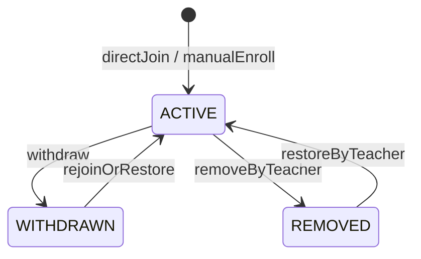
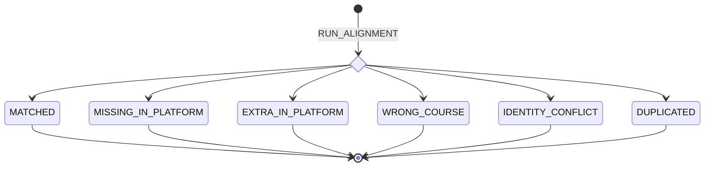
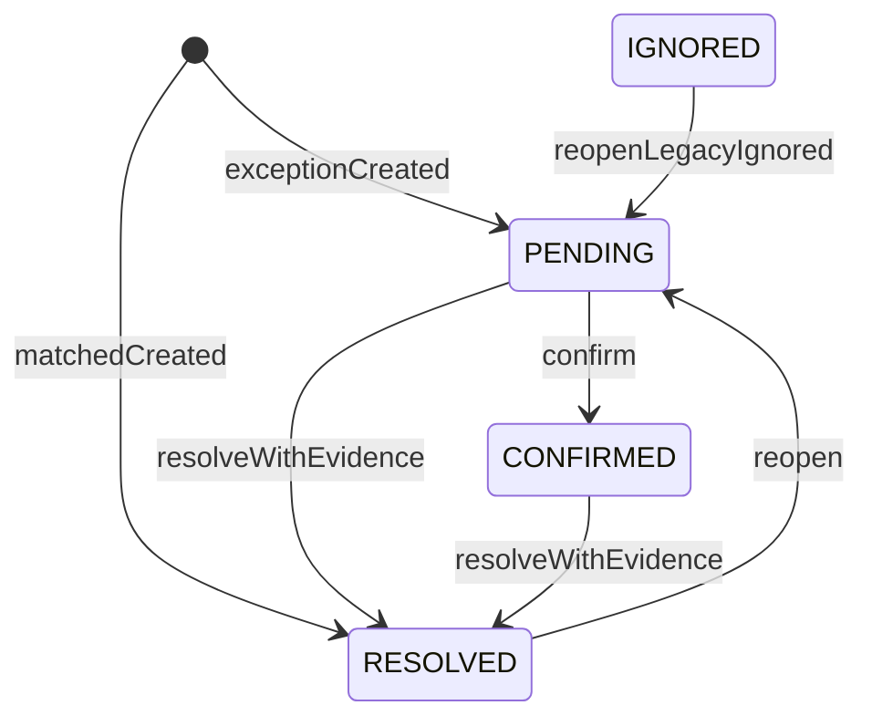
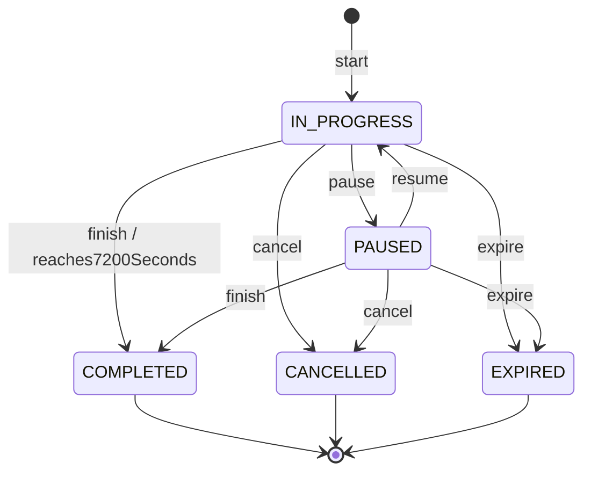
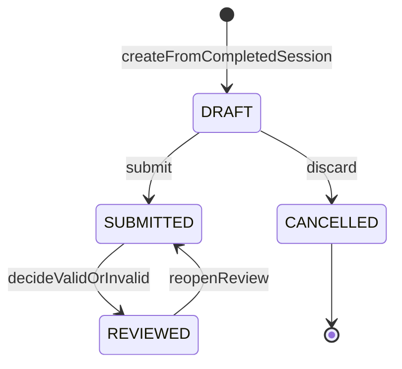
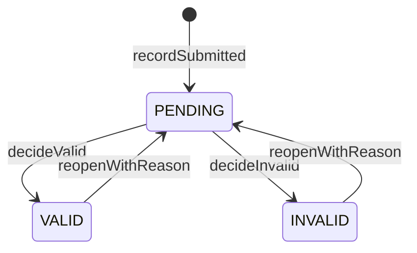
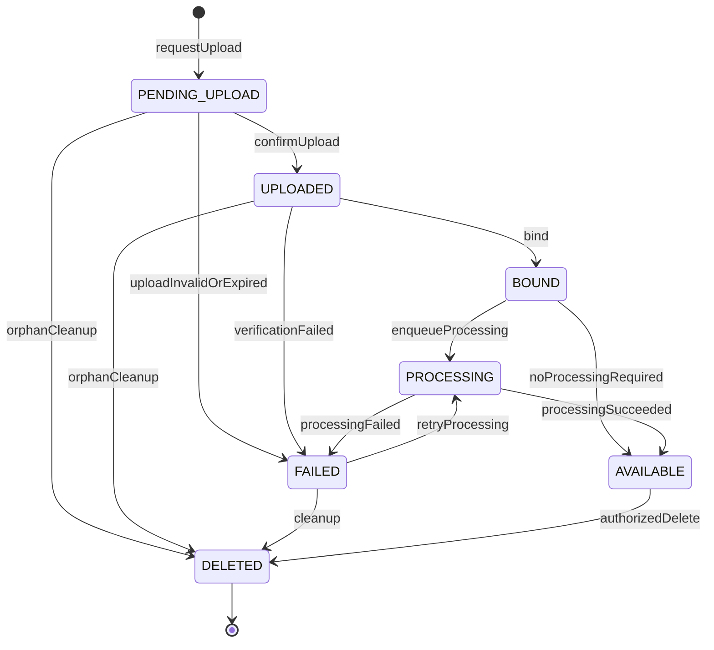
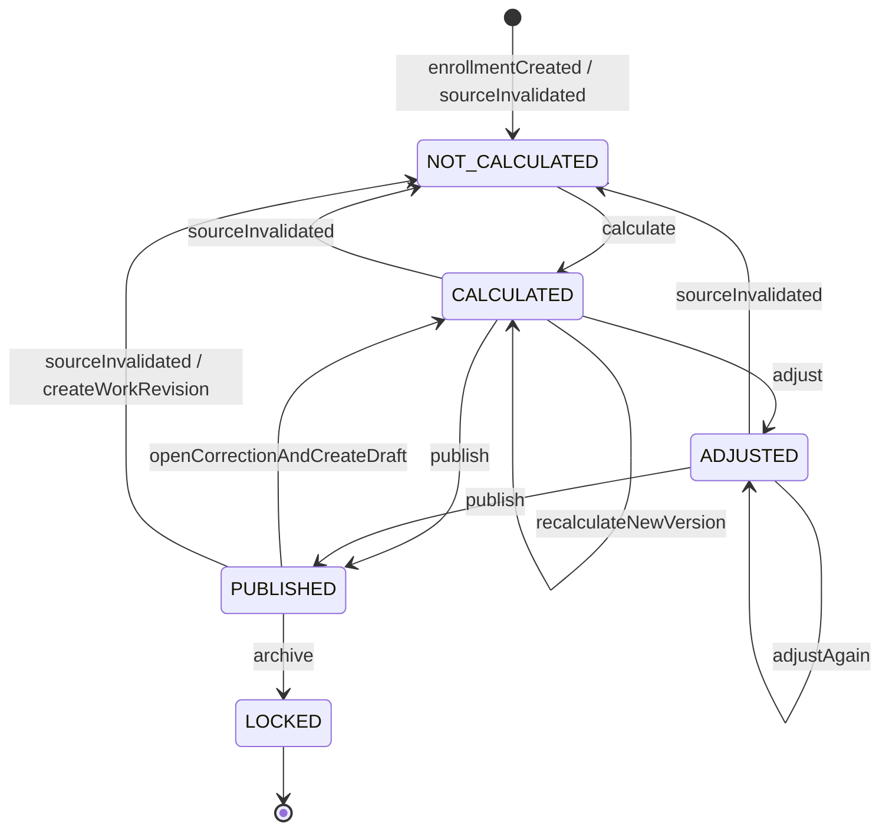
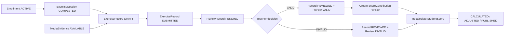

# 统一核心业务状态机

> 阶段：3
>
> 状态：状态契约草案；不代表后端已实现
>
> 基线：`00-current-state-audit.md`、`conflict-matrix.md`、`decision-log.md` 中已接受的 ADR，以及已交叉核对的 `01-domain-model.md`、`02-data-dictionary.md` 与本轮阶段 3 指令
>
> 适用角色：`STUDENT`、`TEACHER`、`ADMIN`。图表中的 `SYSTEM` 是后端事务、定时任务或受信队列消费者，不是新增业务角色。
> 重要迁移口径：本轮采用逐条 `PENDING / VALID / INVALID` 审核模型；旧“提交即有效”只能通过显式迁移记录兼容，不能继续作为新记录的隐式默认值。

## Stage 21 客户端能力状态边界

Stage 21 的 2026-08-05 “30 项全部 default deny、零持久化”结论已由 ADR-097/098 取代。当前 22 个 operation 进入**仅本地集成**：原 12 项通知、推送、偏好、帮助、反馈与版本政策，以及验证码/找回 4 项和免测 6 项。其本地状态边界如下：

- `Notification` 只允许本人把 `readAt: null` 推进为非空；重复标记已读保持幂等，事件、AuditLog 和 Outbox 与聚合版本在同一事务内追加。当前没有业务通知生产者。
- `PushDevice` 只允许本人注册/刷新为 `ACTIVE` 或显式注销为 `REVOKED`；注销清除 token 密文并保留不可逆撤销证据。当前没有 APNs/FCM 发送适配器，也没有自动随会话撤销的生产闭环。
- `UserPreference` 只允许本人创建默认投影或按 `expectedVersion` 更新，并追加变更字段事件。
- `Feedback` 当前只从“无”创建为 `OPEN` 并提供角色范围读取；没有处理、公开回复、关闭或重开 mutation，因此不得把后续状态值当成可执行状态机。
- `HelpArticle` 与 `AppReleasePolicy` 只读已持久化且当前生效的事实；本合同没有发布/编辑 mutation。iOS 只按数字 buildNumber 计算强制性，营销版本文本不参与比较。
- 验证码/找回 challenge 为 `PENDING_DELIVERY -> ACTIVE -> CONSUMED/LOCKED/EXPIRED/DELIVERY_FAILED`；成功验证码只能消费一次。STUDENT 只建立 OTP AuthSession，找回仅 TEACHER/ADMIN。
- 免测申请为 `DRAFT -> SUBMITTED -> APPROVED/REJECTED/SUPPLEMENT_REQUIRED`，补充后可重新提交。只有本人可写，只有责任教师可审核，ADMIN 只读；审核不直接修改成绩。

其余 8 个新增 operation 继续 stable default deny：运动目录/折算 2、GPS/位置 6。拒绝路径不产生成功 AuditLog、业务 Outbox 或状态迁移。GPS 已有持久化和应用层基础，但 HTTP 路由仍由 default-deny service 处理，采样、精度、保留、删除、同意撤回与生产密钥参数均未批准。

## 1. 状态维度分离

### 1.1 八个互不替代的状态维度

| 领域对象 | API / 领域字段 | 状态枚举 | 只回答的问题 | 不得承载的含义 |
|---|---|---|---|---|
| `Enrollment` | `status` | `ACTIVE / WITHDRAWN / REMOVED` | 学生与教学班的成员关系是否仍有效 | 官方名单是否一致、账号是否停用、教学班是否归档 |
| `RosterAlignmentResult` | `status` | `MATCHED / MISSING_IN_PLATFORM / EXTRA_IN_PLATFORM / WRONG_COURSE / IDENTITY_CONFLICT / DUPLICATED` | 某次名单快照与平台成员快照的比对结论 | Enrollment 生命周期、人工处置进度 |
| `RosterAlignmentResult` | `resolutionStatus` | `PENDING / CONFIRMED / RESOLVED / IGNORED` | 教师对异常结果的处置进度 | 比对算法结论；不得用它改写 `status` |
| `ExerciseSession` | `status` | `IN_PROGRESS / PAUSED / COMPLETED / CANCELLED / EXPIRED` | 一次运动计时过程处于哪一阶段 | 是否已经提交打卡、是否审核有效 |
| `ExerciseRecord` | `status` | `DRAFT / SUBMITTED / REVIEWED / CANCELLED` | 一条打卡业务记录处于哪一处理阶段 | 审核结论、媒体上传结果、成绩发布结果 |
| `ReviewRecord` | `result` | `PENDING / VALID / INVALID` | 当前审核版本对记录有效性的裁决 | 记录流程、补材料流程、成绩状态 |
| `MediaEvidence` | `uploadStatus` | `PENDING_UPLOAD / UPLOADED / BOUND / PROCESSING / AVAILABLE / FAILED / DELETED` | 媒体从上传申请到可用或删除的技术生命周期 | 文件用途、所属记录、业务审核结果 |
| `StudentScore` | `status` | `NOT_CALCULATED / CALCULATED / ADJUSTED / PUBLISHED / LOCKED` | 一个成绩版本的计算、调整、发布和锁定阶段 | 耐力跑分项的 `Recorded/Exempt/Absent`、记录审核结果 |

补充约束：

1. 数据库枚举值与 API 枚举值均使用 `UPPER_SNAKE_CASE`；本地化文案只能在客户端展示层映射。
2. 对象可以各自使用局部字段名 `status`，但跨对象 DTO、事件和查询参数必须带资源语境，例如 `enrollment.status` 或 `record.status`；禁止把八个维度压缩成一个顶层通用 `status`。
3. `ExerciseRecord` 不保存可被覆盖的审核结果。当前结果由该记录最高 `reviewVersion` 的 `ReviewRecord.result` 派生。
4. `RosterAlignmentResult.status` 是算法结论；`resolutionStatus` 是人工处置状态。修改备注、确认、忽略或标记已处理不得直接改写算法结论。
5. `MediaEvidence.uploadStatus = BOUND` 是一次绑定成功的生命周期里程碑；长期归属由独立绑定关系或外键表达。后续进入 `PROCESSING / AVAILABLE` 后仍不得丢失绑定关系。
6. 账号状态、学期状态、教学班状态和系统模式是外部守卫，不属于本文件八个状态维度；它们仍可拒绝本文件中的转换。

### 1.2 共同后端转换协议

所有命令型状态转换都必须满足以下共同协议：

| 项目 | 统一要求 |
|---|---|
| 权威方 | 只有后端可以确认转换成功。客户端按钮、缓存、Mock 或乐观 UI 不得成为业务事实。 |
| 资源范围 | 先做 RBAC，再校验 `organizationId`、本人身份、任课教学班关系和目标资源归属。 |
| 状态守卫 | `READ_ONLY / MAINTENANCE`、归档学期、关闭教学班及停用账号按相应策略拒绝写入。 |
| 并发 | 可变聚合携带整数 `version`；命令提交 `expectedVersion`。不匹配返回 `CONFLICT_VERSION_MISMATCH`。 |
| 幂等 | 创建、提交、审核、发布、上传确认等命令接受 `Idempotency-Key`；相同 key + 相同规范化请求返回第一次结果，相同 key + 不同请求返回 `CONFLICT_IDEMPOTENCY_KEY_REUSED`。 |
| 事务 | 状态、领域历史、派生任务/outbox 与审计记录在同一数据库事务中提交；外部通知和媒体处理通过 outbox 异步执行。 |
| 时间 | 服务端生成 RFC3339 时间点；事实时长为整数秒；`businessDate` 由服务端按组织时区和 session `startedAt` 计算。 |
| 审计 | 至少记录 actor、actorRole、organizationId、resourceType/resourceId、before/after、command、reason、requestId、idempotencyKey、createdAt。 |
| 未知状态 | 解析未知枚举必须 fail closed，返回 `CONFLICT_UNSUPPORTED_RESOURCE_STATE` 并告警，不得默认成可写状态。 |
| 通用错误 | `PERMISSION_RESOURCE_SCOPE_DENIED`、`SYSTEM_READ_ONLY`、`CONFLICT_VERSION_MISMATCH`、`CONFLICT_IDEMPOTENCY_KEY_REUSED`、`CONFLICT_STATE_TRANSITION`、`CONFLICT_UNSUPPORTED_RESOURCE_STATE`。 |

下文转换表中的“政策已启用 / ADR 已批准”边是**条件边**，不是当前默认可执行能力。对应决策未确认时，后端必须按第 12 节的保守行为关闭该命令，而不是仅靠客户端隐藏入口。

### 1.3 初始态与终止态总览

| 状态机 | 初始状态 | 终止状态 / 静止状态 |
|---|---|---|
| Enrollment | 邀请与身份校验成功后直接 `ACTIVE`；没有 `PENDING_APPROVAL` | 没有绝对终止态；`WITHDRAWN / REMOVED` 为不活跃静止态，教学班归档后由外部守卫冻结 |
| RosterAlignment | 每次对齐运行直接产生六种分类之一 | 单次运行结果不可变并终止；后续重新对齐创建新版本 |
| ExerciseSession | `IN_PROGRESS` | `COMPLETED / CANCELLED / EXPIRED` |
| ExerciseRecord | `DRAFT` | `CANCELLED` 为终止态；`REVIEWED` 是可按授权重新打开的静止态 |
| ReviewResult | 首条 `ReviewRecord` 为 `PENDING` | 无绝对终止态；`VALID / INVALID` 可按规则追加新版本重新审核 |
| MediaEvidence | `PENDING_UPLOAD` | `DELETED`；`AVAILABLE` 为正常静止态 |
| Score | `NOT_CALCULATED` | 单个已发布版本的 `LOCKED` 为终止态；修正必须创建新工作版本 |

## 2. Enrollment 生命周期

### 2.1 定义与不变量

| 状态 | 定义 | 可产生新打卡 | 备注 |
|---|---|---:|---|
| `ACTIVE` | 学生当前是该 `ClassSection` 的有效成员 | 是，但仍受教学班、账号、系统模式和时间窗守卫 | 扫码/邀请码正常路径直接创建或恢复到此状态 |
| `WITHDRAWN` | 学生主动退出后的成员关系 | 否 | 是否向学生开放主动退出及重入仍为待确认决策 |
| `REMOVED` | 任课教师因课程管理原因移出学生 | 否 | 不删除历史记录、审核、成绩或审计 |

初始态为 `ACTIVE`（合法加入命令原子创建）；没有绝对终态，`WITHDRAWN / REMOVED` 是不活跃静止态，只有表 2.3 的显式恢复命令可以离开。

后端不变量：

- 正常扫码入班不创建 `PENDING_APPROVAL`，也不经过教师审核。
- 同一学生与同一教学班最多一条逻辑 Enrollment；恢复时复用其稳定 `enrollmentId` 并增加版本，不能复制新关系。
- 同一学期是否允许多个 ACTIVE PE Enrollment 由业务规则裁决；当前按阶段 0 既有规则默认拒绝冲突。
- 账号 `DISABLED` 不能映射为 Enrollment `REMOVED`；账号、教学班和 Enrollment 状态分别保存。
- `WITHDRAWN / REMOVED` 后历史事实仍按原 `enrollmentId` 可追溯。

### 2.2 Mermaid 状态图

### 2.3 允许的状态转换

| 当前状态 | 操作 | 目标状态 | 发起角色 | 前置条件 | 后端副作用 | 错误码 |
|---|---|---|---|---|---|---|
| 不存在 | `DIRECT_JOIN` | `ACTIVE` | `STUDENT` | 邀请有效且属于目标教学班；资料校验通过；教学班开放；无同学期冲突 | 原子创建/复用 User、StudentProfile、Enrollment；记录来源；建立会话；写审计/outbox | `COURSE_INVITE_INVALID`、`COURSE_INVITE_EXPIRED`、`COURSE_CLASS_SECTION_NOT_JOINABLE`、`ENROLLMENT_SEMESTER_CONFLICT`、`USER_IDENTITY_CONFLICT` |
| 不存在 | `MANUAL_ENROLL` | `ACTIVE` | `TEACHER` | 教师负责该教学班；学生身份明确；手动添加政策允许 | 创建 Enrollment，来源记为 `MANUAL`；通知学生；写审计 | `PERMISSION_COURSE_SCOPE_DENIED`、`USER_NOT_FOUND`、`ENROLLMENT_SEMESTER_CONFLICT` |
| `ACTIVE` | `DIRECT_JOIN`（重复请求） | `ACTIVE` | `STUDENT` | 请求指向同一学生、邀请码和教学班 | 不新增关系；返回已有 Enrollment；记录幂等命中 | `USER_IDENTITY_CONFLICT`（若 key 或身份不一致） |
| `ACTIVE` | `WITHDRAW` | `WITHDRAWN` | `STUDENT` | 主动退出政策已启用；无阻止退出的已提交事务；提供原因 | 禁止后续提交；保留历史；通知教师；写审计 | `ENROLLMENT_WITHDRAWAL_DISABLED`、`ENROLLMENT_HAS_BLOCKING_WORK` |
| `ACTIVE` | `REMOVE` | `REMOVED` | `TEACHER` | 任课教师；二次确认；原因必填 | 禁止后续提交；保留历史；通知学生；写审计 | `PERMISSION_COURSE_SCOPE_DENIED`、`VALIDATION_FIELD_REQUIRED` |
| `WITHDRAWN` | `REJOIN` | `ACTIVE` | `STUDENT` | 重入政策已启用；新邀请有效；教学班开放；无冲突 | 复用 Enrollment；更新来源/重入时间；写审计 | `ENROLLMENT_REJOIN_DISABLED`、`COURSE_INVITE_INVALID`、`ENROLLMENT_SEMESTER_CONFLICT` |
| `WITHDRAWN` | `RESTORE` | `ACTIVE` | `TEACHER` | 任课教师；恢复原因；教学班开放 | 复用 Enrollment；通知学生；写审计 | `PERMISSION_COURSE_SCOPE_DENIED`、`COURSE_CLASS_SECTION_NOT_JOINABLE` |
| `REMOVED` | `RESTORE` | `ACTIVE` | `TEACHER` | 原移出教学班的任课教师；明确恢复原因；无同学期冲突 | 复用 Enrollment；通知学生；写审计 | `PERMISSION_COURSE_SCOPE_DENIED`、`VALIDATION_FIELD_REQUIRED`、`ENROLLMENT_SEMESTER_CONFLICT` |

### 2.4 禁止转换与运行合同

禁止：

- 任意状态转入 `PENDING_APPROVAL`。
- 学生自行把 `REMOVED` 恢复为 `ACTIVE`。
- 管理员以固有权限代替教师执行日常移出/恢复；如未来需要临时授权，应使用独立授权资源。
- 通过改账号状态、名单结果、教学班状态间接覆盖 Enrollment 状态。
- 对归档教学班执行加入、退出、移出或恢复。
- 物理删除 Enrollment 以表达退出或移出。

| 运行维度 | Enrollment 合同 |
|---|---|
| 后端校验 | 邀请签名/过期/撤销、StudentProfile 与 `studentNumber` 一致性、组织与教学班归属、教学班容量与开放状态、同学期唯一约束、系统模式、`expectedVersion`。 |
| 审计 | 所有非重复转换必须审计；重复直接加入仅记录安全遥测，不重复通知。 |
| 撤销 | 移出/退出不能删除历史；只允许通过显式 `RESTORE / REJOIN` 形成反向转换。 |
| 幂等 | `(studentId, classSectionId)` 唯一约束兜底；直接加入与手动添加必须接受幂等键。 |
| 异常恢复 | 事务失败不产生半条 Enrollment；客户端超时后按幂等键查询结果。若通知失败，outbox 重试但不回滚已成功入班。 |

## 3. RosterAlignment 名单对齐

### 3.1 分类不是 Enrollment 状态

一次对齐必须固定引用 `OfficialRosterImport`/官方名单版本与平台 Enrollment 快照版本。`RosterAlignmentResult.status` 是该次运行的不可变算法结论；修复数据后重新运行会产生新结果版本，而不是原地把 `WRONG_COURSE` 改成 `MATCHED`。

`RosterAlignmentRun.status` 的 V1 闭集为 `RUNNING → COMPLETED` 或 `RUNNING → FAILED`。Run 创建时冻结 `ROSTER_ALIGNMENT_V1`、单调递增的 `comparisonRevision`、同学期 ACTIVE Enrollment 最小快照及其 canonical SHA-256 fingerprint；完成或失败后禁止普通更新。每个 ClassSection 同时最多一个 RUNNING Run。

每个结果在 `RUN_ALIGNMENT` 时直接进入六种分类之一，并立即成为该运行版本的终态；不存在分类间转换。后续重跑创建新结果。独立的 `resolutionStatus` 初始为异常的 `PENDING` 或匹配项的 `RESOLVED`。当前保守合同只允许进入 `CONFIRMED / RESOLVED`；`IGNORED` 仅为兼容历史数据和后续可能批准的策略而保留，不能由新命令产生。

| `status` | 判断条件 | 推荐修复动作 | 可否忽略（当前保守合同） |
|---|---|---|---|
| `MATCHED` | 学号相同，且双方提供的主要身份字段一致 | 无 | 不适用 |
| `MISSING_IN_PLATFORM` | 官方名单有，平台目标教学班与教师可见范围内均无对应 Enrollment | 邀请学生入班或教师受控手动添加 | 当前不可；待 ADR-057 决策 |
| `EXTRA_IN_PLATFORM` | 平台目标教学班有 ACTIVE Enrollment，官方名单无该学号 | 核对名单版本、移出或更正官方数据 | 当前不可；待 ADR-057 决策 |
| `WRONG_COURSE` | 学号能唯一匹配，但 Enrollment 所属教学班与官方归属不同 | 受控转班/移出后重入 | 默认不可忽略 |
| `IDENTITY_CONFLICT` | 学号一致但姓名/性别/年级等主要字段冲突；同名异号只作为候选证据 | 核验身份后修正权威 Profile 或官方数据 | 当前不可；待 ADR-057 决策；不得自动合并 |
| `DUPLICATED` | 官方名单或平台成员中同一学号出现多条，无法形成唯一匹配 | 先消除重复事实再重跑 | 不可忽略 |

`resolutionStatus` 单独定义：

| 状态 | 定义 |
|---|---|
| `PENDING` | 异常尚未确认或处置；异常结果默认值 |
| `CONFIRMED` | 教师已确认算法结果真实，但修复尚未完成 |
| `RESOLVED` | 修复已完成，并有新对齐结果或其他可审计证据证明问题消失 |
| `IGNORED` | 兼容历史数据或后续获批策略的保留值；当前不得由新命令产生；既有值只能重开 |

`MATCHED` 结果创建时 `resolutionStatus` 直接为 `RESOLVED`；其他分类默认为 `PENDING`。

### 3.2 Mermaid 状态图

单次运行的不可变分类：

独立的人工处置状态：

### 3.3 允许的状态转换

分类生成：

| 当前状态 | 操作 | 目标状态 | 发起角色 | 前置条件 | 后端副作用 | 错误码 |
|---|---|---|---|---|---|---|
| 不存在 | `RUN_ALIGNMENT` | `MATCHED` | `TEACHER` | 任课教学班；当前名单与平台快照可读；同一标准化学号唯一且主要身份/教学班一致 | 创建不可变结果；生成稳定结果键；`resolutionStatus=RESOLVED`；写审计 | `ROSTER_IMPORT_NOT_FOUND`、`PERMISSION_COURSE_SCOPE_DENIED`、`ROSTER_ALIGNMENT_SNAPSHOT_STALE` |
| 不存在 | `RUN_ALIGNMENT` | `MISSING_IN_PLATFORM` | `TEACHER` | 官方条目存在，目标教学班平台快照无对应 Enrollment | 创建不可变异常结果；`resolutionStatus=PENDING`；写审计 | `ROSTER_IMPORT_NOT_FOUND`、`ROSTER_ALIGNMENT_SNAPSHOT_STALE` |
| 不存在 | `RUN_ALIGNMENT` | `EXTRA_IN_PLATFORM` | `TEACHER` | 目标教学班平台 Enrollment 存在，当前官方名单无该标准化学号 | 创建不可变异常结果；`resolutionStatus=PENDING`；写审计 | `ROSTER_IMPORT_NOT_FOUND`、`ROSTER_ALIGNMENT_SNAPSHOT_STALE` |
| 不存在 | `RUN_ALIGNMENT` | `WRONG_COURSE` | `TEACHER` | 学生可唯一匹配，但平台 Enrollment 与官方目标教学班不一致 | 创建不可变异常结果；保存双方教学班差异；`resolutionStatus=PENDING` | `PERMISSION_COURSE_SCOPE_DENIED`、`ROSTER_ALIGNMENT_SNAPSHOT_STALE`、`ROSTER_ALIGNMENT_IN_PROGRESS` |
| 不存在 | `RUN_ALIGNMENT` | `IDENTITY_CONFLICT` | `TEACHER` | 学号相同但受核对身份字段冲突，或候选证据不足以自动合并 | 创建不可变异常结果；保存白名单差异而不自动改 Profile；`resolutionStatus=PENDING` | `PERMISSION_COURSE_SCOPE_DENIED`、`ROSTER_ALIGNMENT_SNAPSHOT_STALE`、`ROSTER_ALIGNMENT_IN_PROGRESS` |
| 不存在 | `RUN_ALIGNMENT` | `DUPLICATED` | `TEACHER` | 当前官方名单或平台快照中同一标准化学号出现多条而不能唯一匹配 | 创建不可变异常结果；保留重复来源行引用；`resolutionStatus=PENDING` | `PERMISSION_COURSE_SCOPE_DENIED`、`ROSTER_ALIGNMENT_SNAPSHOT_STALE`、`ROSTER_ALIGNMENT_IN_PROGRESS` |
| 任一旧结果版本 | `RERUN_ALIGNMENT` | 新结果版本的六种 `status` 之一 | `TEACHER` | 输入版本明确；无同教学班并发运行 | 不覆盖旧结果；保留可匹配的备注和处置历史；写新版本 | `ROSTER_ALIGNMENT_IN_PROGRESS`、`ROSTER_ALIGNMENT_INPUT_VERSION_CONFLICT` |

处置转换：

| 当前状态 | 操作 | 目标状态 | 发起角色 | 前置条件 | 后端副作用 | 错误码 |
|---|---|---|---|---|---|---|
| `PENDING` | `CONFIRM` | `CONFIRMED` | `TEACHER` | 任课教学班；异常仍属于当前结果版本 | 写处置事件、操作者和时间 | `ROSTER_ALIGNMENT_RESULT_SUPERSEDED`、`PERMISSION_COURSE_SCOPE_DENIED` |
| `PENDING` | `RESOLVE` | `RESOLVED` | `TEACHER` | 提供同组织可访问的 `NEW_ALIGNMENT_RESULT`、`ENROLLMENT_STATUS_EVENT` 或 `OFFICIAL_ROSTER_VERSION` 真实引用 | 追加不可变处置事件并更新当前投影；写审计/Outbox | `ROSTER_RESOLUTION_EVIDENCE_REQUIRED`、`ROSTER_RESOLUTION_INVALID` |
| `CONFIRMED` | `RESOLVE` | `RESOLVED` | `TEACHER` | 任课教学班；提供上述白名单真实证据 | 追加不可变处置事件并更新当前投影；写审计/Outbox | `ROSTER_RESOLUTION_EVIDENCE_REQUIRED`、`PERMISSION_COURSE_SCOPE_DENIED` |
| `RESOLVED` | `REOPEN` | `PENDING` | `TEACHER` | 当前版本仍可处置；原因必填 | 追加重新打开事件；不删除旧证据 | `VALIDATION_FIELD_REQUIRED`、`ROSTER_ALIGNMENT_RESULT_SUPERSEDED` |
| `IGNORED`（仅既有数据） | `REOPEN` | `PENDING` | `TEACHER` | 任课教学班；当前结果版本仍可处置；重新打开原因必填 | 清除“当前忽略”投影但保留历史原因；追加重新打开事件 | `VALIDATION_FIELD_REQUIRED`、`ROSTER_ALIGNMENT_RESULT_SUPERSEDED`、`PERMISSION_COURSE_SCOPE_DENIED` |

### 3.4 禁止转换与运行合同

禁止：

- 教师手工把 `status` 从一种算法分类改成另一种；必须修复来源后重跑。
- 以姓名相同自动合并不同学号。
- 将 `resolutionStatus` 映射为 Enrollment `ACTIVE/REMOVED`。
- 在 ADR-057 被接受前，对任何分类执行 `IGNORE`；命令统一返回 `ROSTER_IGNORE_NOT_ALLOWED`。
- 覆盖或删除旧名单版本、旧对齐运行和旧处置事件。

| 运行维度 | RosterAlignment 合同 |
|---|---|
| 后端校验 | 文件/版本完整性、学号字符串、教师教学班范围、快照一致性、单次运行互斥、稳定结果键、操作对应的当前结果版本。 |
| 审计 | 导入、重跑、确认、处理、既有 IGNORED 记录的重新打开、备注修改和导出均需审计。 |
| 撤销 | 分类不可撤销；处置可通过 `REOPEN` 撤销当前投影，历史不删除。 |
| 幂等 | 对齐命令由 `Idempotency-Key`、classSection/import、算法版本和后端生成的 snapshot fingerprint 绑定；处置命令按幂等键、动作、请求体与结果 `version` 去重。 |
| 异常恢复 | 对齐任务失败不发布部分结果；任务保持失败诊断并允许同输入安全重试。浏览器解析结果不得直接成为服务器当前官方名单。 |

## 4. ExerciseSession 运动计时状态机

### 4.1 状态定义与不变量

| 状态 | 定义 | 是否继续累计 | 是否可生成 Record 草稿 |
|---|---|---:|---:|
| `IN_PROGRESS` | 运动计时正在进行 | 是 | 否 |
| `PAUSED` | 学生主动暂停；暂停区间不计入实际有效时长 | 否 | 否 |
| `COMPLETED` | 学生主动结束，或实际有效时长达到 7200 秒后由服务端封顶结束 | 否 | 是 |
| `CANCELLED` | 学生明确取消本次计时 | 否 | 否 |
| `EXPIRED` | 会话因超时、跨允许边界或服务端恢复策略而失效 | 否 | 否 |

初始态为 `IN_PROGRESS`；`COMPLETED / CANCELLED / EXPIRED` 均为不可恢复终态。

核心不变量：

- `actualDurationSeconds` 与 `pausedDurationSeconds` 均为非负整数；暂停时间不能计入实际有效时长。
- 服务端时间和事件序列是最终事实；客户端单调时钟只作为观测与异常检测证据。
- 同一学生在策略范围内最多一个非终态 session；多设备不能并行累计。
- 达到 7200 秒时必须转为 `COMPLETED` 并停止累计，不能借用 `PAUSED` 表示封顶。
- `COMPLETED` 只说明计时结束，不说明已经提交 `ExerciseRecord`。
- `businessDate` 由服务端按 `ClassSection.organization` 时区和 `startedAt` 计算并保持不变。

### 4.2 Mermaid 状态图

### 4.3 允许的状态转换

| 当前状态 | 操作 | 目标状态 | 发起角色 | 前置条件 | 后端副作用 | 错误码 |
|---|---|---|---|---|---|---|
| 不存在 | `START` | `IN_PROGRESS` | `STUDENT` | 本人 ACTIVE Enrollment；教学班和时间窗允许；当日无已占用提交；无其他非终态 session | 创建 session；写服务端 `startedAt/businessDate`；初始化 version；写安全事件 | `ENROLLMENT_NOT_ACTIVE`、`COURSE_CHECKIN_WINDOW_CLOSED`、`EXERCISE_RECORD_DAILY_LIMIT_REACHED`、`SESSION_ALREADY_ACTIVE` |
| `IN_PROGRESS` | `PAUSE` | `PAUSED` | `STUDENT` | 本人 session；版本一致；尚未封顶 | 固化当前运动片段和 `pausedAt`；停止累计 | `PERMISSION_RESOURCE_SCOPE_DENIED`、`SESSION_DURATION_CAP_REACHED` |
| `PAUSED` | `RESUME` | `IN_PROGRESS` | `STUDENT` | 本人 session；仍在允许恢复窗口；版本一致 | 结束暂停区间；创建新运动片段 | `SESSION_RESUME_WINDOW_EXPIRED`、`COURSE_CHECKIN_WINDOW_CLOSED` |
| `IN_PROGRESS` | `FINISH` | `COMPLETED` | `STUDENT` | 本人 session；时序完整 | 服务端重算并冻结实际/暂停时长与结束时间；允许创建 Record 草稿 | `SESSION_TIMELINE_INVALID` |
| `PAUSED` | `FINISH` | `COMPLETED` | `STUDENT` | 本人 session；时序完整 | 关闭当前暂停区间；冻结时长；允许创建 Record 草稿 | `SESSION_TIMELINE_INVALID` |
| `IN_PROGRESS` | `REACH_DURATION_CAP` | `COMPLETED` | `SYSTEM` | 服务端计算实际有效时长达到 7200 秒 | `actualDurationSeconds` 封顶 7200；写 `endReason=DURATION_LIMIT_REACHED`；通知客户端停止 | `SESSION_TIMELINE_INVALID` |
| `IN_PROGRESS` | `CANCEL` | `CANCELLED` | `STUDENT` | 本人 session；尚未形成已提交 Record | 冻结取消时间与原因；处理未绑定媒体草稿 | `SESSION_ALREADY_USED` |
| `PAUSED` | `CANCEL` | `CANCELLED` | `STUDENT` | 本人 session；尚未形成已提交 Record；版本一致 | 关闭当前暂停区间；冻结取消时间、可信时长和原因；处理未绑定媒体草稿 | `SESSION_ALREADY_USED`、`PERMISSION_RESOURCE_SCOPE_DENIED` |
| `IN_PROGRESS` | `EXPIRE` | `EXPIRED` | `SYSTEM` | 心跳/恢复窗口超出已配置阈值，或会话跨越禁止边界 | 冻结最后可信时长；标记失效原因；进入草稿/媒体清理策略 | `SESSION_EXPIRATION_NOT_ALLOWED` |
| `PAUSED` | `EXPIRE` | `EXPIRED` | `SYSTEM` | 心跳/恢复窗口超出已配置阈值，或会话跨越禁止边界 | 关闭暂停区间；冻结最后可信时长；标记失效原因；进入草稿/媒体清理策略 | `SESSION_EXPIRATION_NOT_ALLOWED` |

### 4.4 禁止转换与运行合同

禁止：

- `COMPLETED / CANCELLED / EXPIRED` 回到 `IN_PROGRESS / PAUSED`；恢复运动必须创建新 session。
- 客户端自行把 `actualDurationSeconds` 写成最终值，或通过修改设备时钟扩展时长。
- `PAUSED` 继续累计；达到 7200 秒后继续计时。
- 从 `IN_PROGRESS / PAUSED` 直接标记 Record `SUBMITTED`。
- 用 session `SUBMITTED` 状态表示 Record 已提交；该旧状态必须拆分。

| 运行维度 | ExerciseSession 合同 |
|---|---|
| 后端校验 | Enrollment 与本人范围、系统/教学班/时间窗、单活动 session 唯一约束、事件顺序、server/client 时间偏差、心跳阈值、7200 秒封顶、`expectedVersion`。 |
| 审计 | START/FINISH/CANCEL/EXPIRE 和异常时钟必须审计；高频心跳仅写运行遥测，不逐条写业务审计。 |
| 撤销 | PAUSE 可由 RESUME 继续；COMPLETED/CANCELLED/EXPIRED 不撤销。错误完成只能新建 session，并由后续人工流程处理旧记录。 |
| 幂等 | 每个控制命令必须带幂等键；重复 PAUSE/FINISH 返回首次结果。不同 key 对已离开状态的命令返回 `SESSION_TRANSITION_NOT_ALLOWED`。 |
| 异常恢复 | App 重启通过 `GET active session` 恢复；离线事件按本地单调序列上传，由服务端验证后接纳或拒绝。未知或不可重建的时间段不计入事实时长。 |

## 5. ExerciseRecord 打卡流程状态机

### 5.1 状态定义与审核关联

| 状态 | 定义 | 当前 ReviewResult | 是否贡献有效时长 |
|---|---|---|---:|
| `DRAFT` | 已由 COMPLETED session 创建但尚未正式提交，可继续绑定媒体和填写说明 | 无 | 否 |
| `SUBMITTED` | 学生已提交，内容冻结并等待教师处理 | `PENDING` | 否 |
| `REVIEWED` | 当前审核版本已经给出 `VALID` 或 `INVALID` | `VALID` 或 `INVALID` | 仅 `VALID`，并使用该审核版本确认的计入秒数 |
| `CANCELLED` | 草稿被放弃，或按已批准撤回规则取消 | 历史 ReviewRecord 可保留；当前不计分 | 否 |

初始态为 `DRAFT`；`CANCELLED` 是不可恢复终态，`REVIEWED` 是可由授权重审命令离开的静止态。

核心不变量：

- `ExerciseSession : ExerciseRecord = 1 : 0..1`。同一 session 最多形成一条逻辑 Record。
- `ExerciseRecord : ReviewRecord = 1 : 0..N`；Record 提交后必须至少存在一条由系统创建的 `PENDING` ReviewRecord。
- Record 只存流程 `status`；不得存可覆盖的 `reviewStatus/auditStatus/approved`。
- `REVIEWED` 不能单独推断有效性，必须读取最高 `reviewVersion` 的 `ReviewRecord.result`。
- 阶段提示词要求评估 `NEEDS_REVISION`，但现行学生/教师业务均明确打卡不提供“补材料”。因此 v1 **不把 `NEEDS_REVISION` 纳入可写枚举，也不提供 REQUEST_REVISION/RESUBMIT 转换**（ADR-055）；旧值按 10.4 的迁移规则回到 `SUBMITTED + PENDING`，教师只能作 `VALID/INVALID` 裁决。
- 记录事实字段、原始 session、原始媒体和历史 ReviewRecord 不因 `INVALID/CANCELLED` 物理删除。

### 5.2 Mermaid 状态图

### 5.3 允许的状态转换

| 当前状态 | 操作 | 目标状态 | 发起角色 | 前置条件 | 后端副作用 | 错误码 |
|---|---|---|---|---|---|---|
| 不存在 | `CREATE_DRAFT` | `DRAFT` | `STUDENT` | 本人 session 为 COMPLETED；该 session 尚无 Record | 创建 Record 并关联 session/enrollment/classSection/businessDate；不占用每日成功提交次数 | `SESSION_NOT_COMPLETED`、`EXERCISE_RECORD_ALREADY_EXISTS_FOR_SESSION` |
| `DRAFT` | `SUBMIT` | `SUBMITTED` | `STUDENT` | 本人 Record；身份与 Enrollment 有效；时长由服务端重算；绑定 1..7 个同属本记录且 AVAILABLE 的媒体；用途通过；唯一 `(enrollmentId,businessDate)` 通过 | 冻结提交快照；创建 ReviewRecord v1=`PENDING`；占用当日提交；通知教师；写审计/outbox | `EXERCISE_RECORD_MEDIA_INCOMPLETE`、`MEDIA_NOT_AVAILABLE`、`EXERCISE_RECORD_DAILY_LIMIT_REACHED`、`EXERCISE_RECORD_DURATION_NOT_CREDITABLE` |
| `DRAFT` | `DISCARD` | `CANCELLED` | `STUDENT` | 本人 Record；未提交 | 记录取消原因；解绑/清理媒体按保留策略执行 | `PERMISSION_RESOURCE_SCOPE_DENIED` |
| `SUBMITTED` | `REVIEW` | `REVIEWED` | `TEACHER` | 单一责任教师；当前 ReviewResult=PENDING；`expectedVersion` 与 `expectedReviewVersion` 同时匹配；VALID/INVALID 字段规则完整 | 同一数据库事务取得 Record/Review 并发保护、追加唯一 `(recordId,reviewVersion)` ReviewRecord、更新 Record、写 AuditLog/Outbox；触发重算 | `REVIEW_RESULT_REQUIRED`、`REVIEW_INVALID_REASON_REQUIRED`、`CONFLICT_VERSION_MISMATCH` |
| `REVIEWED` | `REOPEN_REVIEW` | `SUBMITTED` | `TEACHER` | 单一责任教师；原因必填；未归档或已有批准修正窗口；`expectedVersion` 与 `expectedReviewVersion` 匹配 | 同一事务追加新 ReviewRecord=`PENDING` 并引用前一版本；暂时移除该记录有效时长；触发重算 | `VALIDATION_FIELD_REQUIRED`、`SCORE_LOCKED`、`SCORE_CORRECTION_WINDOW_REQUIRED`、`CONFLICT_VERSION_MISMATCH` |

批量审核不是特殊状态转换：后端对每条 Record 独立执行 `SUBMITTED -> REVIEWED`，每条写独立 ReviewRecord、`expectedVersion`/`expectedReviewVersion` 检查和错误结果；不得以一个班级级状态覆盖所有记录。

### 5.4 禁止转换与运行合同

禁止：

- `DRAFT` 直接进入 `REVIEWED`。
- `SUBMITTED / REVIEWED` 回到 `DRAFT`。
- 创建或写入 `UNDER_REVIEW`、`CLAIM_REVIEW`、claimant、claimedAt、claim lease、release 或 reclaim；V1 没有审核领取语义。
- v1 禁止产生或接受 `NEEDS_REVISION`；打卡凭证不提供补材料流程。
- `REVIEWED` 直接改成另一审核结论；必须 `REOPEN_REVIEW` 产生新 PENDING 版本后再审核。
- `SUBMITTED` 由学生撤回；V1 接口稳定返回 `EXERCISE_RECORD_WITHDRAWAL_NOT_ALLOWED` 且不产生副作用，也不释放 `(enrollmentId,businessDate)` 槽位。
- `CANCELLED` 恢复；如确需重新打卡必须新建 session/record。
- 教师修改原始运动时钟、原始媒体或学生身份来实现“审核调整”。
- 管理员默认代替任课教师审核。

| 运行维度 | ExerciseRecord 合同 |
|---|---|
| 后端校验 | Session/Enrollment/Student/教学班全链路一致、业务日期、每日唯一约束、时长边界、媒体可用和归属、允许修改字段、教师教学班范围、Review/Record version。 |
| 审计 | 创建草稿可记轻量事件；提交、撤回、审核和重新打开均必须审计。 |
| 撤销 | 草稿可丢弃；V1 已提交撤回关闭；已审核不能撤销事实，只能重新打开并追加审核版本。 |
| 幂等 | `sessionId` 唯一约束防重复 Record；SUBMIT/REVIEW/WITHDRAW 均使用幂等键。 |
| 异常恢复 | 提交超时后按幂等键或 sessionId 查询；媒体/通知异步失败不伪造提交失败。若事务中审核写入或成绩失效任一步失败，则整体回滚。 |

## 6. ReviewResult 审核结果状态机

### 6.1 Append-only 模型

`ReviewResult` 不是 `ExerciseRecord` 上可更新的列，而是 `ReviewRecord.result` 的枚举。每次变化追加新 ReviewRecord，核心字段至少包括 `reviewVersion`、`result`、`previousReviewId`、`teacherId`、原因/意见、可选 `creditedDurationOverrideSeconds`、`reviewedAt`、`createdAt`。当前结果取最高 `reviewVersion`；旧版本不可修改或删除。由系统初始化的首条 `PENDING` 记录没有审核教师，因此其 `teacherId=null`；教师创建的 `VALID / INVALID` 以及教师主动重开产生的 `PENDING` 必须写入当前 `teacherId`。

| 结果 | 定义 | Record 的正常流程状态 | 评分贡献 |
|---|---|---|---:|
| `PENDING` | 尚无最终有效性裁决，或旧裁决已被重新打开 | `SUBMITTED` | 0 秒 |
| `VALID` | 任课教师确认记录有效 | `REVIEWED` | 服务端规则秒数，或已审计的覆盖秒数 |
| `INVALID` | 任课教师确认记录无效 | `REVIEWED` | 0 秒 |

初始结果为首条系统 `PENDING`；`VALID / INVALID` 是可通过显式重开离开的静止结果，没有可覆盖的终态行。

`creditedDurationOverrideSeconds` 只能在专门 ADR 批准后开放，并且只能为当前规则允许的整数秒，不能改写 session 原始事实。ADR 未批准时所有新审核必须写 `null` 并沿用 Record 的服务端折算值；它即使获批也只表达审核后计入量，不表达流程状态。

V1 原因合同：VALID 不要求 `reasonCode`；INVALID 必须提供 `ReviewReasonCode`；选择 `OTHER` 时 `reason` 必须 trim 后非空。`reason` 最大 500、`publicComment` 最大 1000、`internalNote` 最大 2000。学生 `currentReview` 只包含 result、reasonCode、publicComment；完整原因正文、internalNote 和审核历史只在教师授权 projection 中出现。

### 6.2 Mermaid 状态图

### 6.3 允许的状态转换

| 当前状态 | 操作 | 目标状态 | 发起角色 | 前置条件 | 后端副作用 | 错误码 |
|---|---|---|---|---|---|---|
| 不存在 | `INITIALIZE_REVIEW` | `PENDING` | `SYSTEM` | Record 在同一事务进入 SUBMITTED；尚无 ReviewRecord | 创建 reviewVersion=1；不计入有效时长 | `REVIEW_ALREADY_INITIALIZED` |
| `PENDING` | `MARK_VALID` | `VALID` | `TEACHER` | 任课教师；证据可用；Record 可审核；公开意见符合规则；`creditedDurationOverrideSeconds` 默认必须为 null，只有专门 ADR 已批准时才按批准范围校验 | 追加下一 reviewVersion；Record 进入 REVIEWED；重算累计与成绩；生成学生通知 | `PERMISSION_COURSE_SCOPE_DENIED`、`MEDIA_NOT_AVAILABLE`、`REVIEW_CREDIT_OVERRIDE_NOT_APPROVED`、`REVIEW_CREDIT_DURATION_INVALID`、`CONFLICT_VERSION_MISMATCH` |
| `PENDING` | `MARK_INVALID` | `INVALID` | `TEACHER` | 任课教师；标准原因必填；Record 可审核 | 追加下一 reviewVersion；Record 进入 REVIEWED；有效时长为 0；重算；通知学生 | `REVIEW_INVALID_REASON_REQUIRED`、`PERMISSION_COURSE_SCOPE_DENIED`、`CONFLICT_VERSION_MISMATCH` |
| `VALID` | `REOPEN` | `PENDING` | `TEACHER` | 任课教师；原因必填；未锁定或有修正窗口；`expectedReviewVersion`/`expectedVersion` 匹配 | 事务追加 PENDING 版本并引用旧版本；Record 回到 SUBMITTED；暂时撤销评分贡献；重算 | `VALIDATION_FIELD_REQUIRED`、`SCORE_LOCKED`、`SCORE_CORRECTION_WINDOW_REQUIRED`、`CONFLICT_VERSION_MISMATCH` |
| `INVALID` | `REOPEN` | `PENDING` | `TEACHER` | 任课教师；原因必填；未锁定或已有批准修正窗口；`expectedReviewVersion`/`expectedVersion` 匹配 | 事务追加 PENDING 版本并引用旧版本；Record 回到 SUBMITTED；写审计并触发输入失效检查 | `VALIDATION_FIELD_REQUIRED`、`SCORE_LOCKED`、`SCORE_CORRECTION_WINDOW_REQUIRED`、`CONFLICT_VERSION_MISMATCH` |

### 6.4 禁止转换与运行合同

禁止：

- `VALID <-> INVALID` 直接覆盖；必须先追加 `PENDING` 重开版本。
- `PENDING` 记录贡献任何有效时长。
- AI 风险分、管理员全局权限或前端按钮直接产生最终 `VALID/INVALID`。
- 在没有对应 ACTIVE/历史可审教学班归属的情况下审核。
- 修改旧 ReviewRecord、复用旧 reviewVersion 或把教师内部备注下发学生端。
- 在专门 ADR 未批准时写入非 null 的 `creditedDurationOverrideSeconds`。
- 用旧 `NEEDS_REVISION`、`APPROVED/REJECTED` 替代 ReviewResult。

| 运行维度 | ReviewResult 合同 |
|---|---|
| 后端校验 | 最新 reviewVersion、Record 流程状态、教师教学班范围、媒体可用性、标准原因、公开/内部意见投影隔离、override ADR 开关与计入秒数范围、成绩锁定/修正窗口。 |
| 审计 | 每条 ReviewRecord 本身是领域历史；同时写不可变 AuditLog，记录 before/after review id、批次 id（如有）与重算任务。 |
| 撤销 | 不删除或反写旧结论；`REOPEN` 追加 PENDING 版本是唯一撤销方式。 |
| 幂等 | 审核命令以 `(recordId, expectedReviewVersion, idempotencyKey)` 去重；批量操作仍逐记录返回成功/失败。 |
| 异常恢复 | 审核、Record 状态和 score invalidation 同事务；重算 worker 可按 outbox 重试。若投递通知失败，不回滚审核事实。 |

## 7. MediaEvidence 媒体上传状态机

### 7.1 状态定义与绑定边界

| 状态 | 定义 | 可用于 Record 提交 |
|---|---|---:|
| `PENDING_UPLOAD` | 后端已签发上传会话，等待客户端上传/确认 | 否 |
| `UPLOADED` | 对象存储已收到对象，后端完成最小存在性、大小、哈希和类型确认 | 否 |
| `BOUND` | 后端已确认该媒体与目标 session/record 的业务绑定 | 否，仍需完成处理 |
| `PROCESSING` | 正在执行病毒扫描、文件签名校验、元数据提取、转码或缩略图任务 | 否 |
| `AVAILABLE` | 安全检查完成，可由授权业务读取 | 是 |
| `FAILED` | 上传确认或处理失败；保存机器可读失败码 | 否 |
| `DELETED` | 逻辑删除完成，存储对象已删除或进入可重试清理 | 否 |

初始态为 `PENDING_UPLOAD`；`DELETED` 是不可恢复终态，`AVAILABLE` 是正常静止态，`FAILED` 只在失败原因可重试时允许离开。

绑定关系必须继续由 `recordId/sessionId/businessPurpose` 等关联字段表达。`BOUND -> PROCESSING -> AVAILABLE` 后，`uploadStatus` 不再显示 BOUND，但绑定关系仍存在；禁止靠当前 `uploadStatus` 猜测对象归属。

### 7.2 Mermaid 状态图

### 7.3 允许的状态转换

| 当前状态 | 操作 | 目标状态 | 发起角色 | 前置条件 | 后端副作用 | 错误码 |
|---|---|---|---|---|---|---|
| 不存在 | `REQUEST_UPLOAD` | `PENDING_UPLOAD` | `STUDENT` | 本人 ACTIVE session 或可编辑 Record；用途和媒体数量允许；声明类型/大小合法 | 创建 mediaId；签发短期、最小权限上传参数；记录过期时间 | `MEDIA_COUNT_LIMIT_EXCEEDED`、`MEDIA_TYPE_NOT_ALLOWED`、`MEDIA_SIZE_EXCEEDED`、`MEDIA_CAPTURE_SOURCE_NOT_ALLOWED` |
| `PENDING_UPLOAD` | `CONFIRM_UPLOAD` | `UPLOADED` | `STUDENT` | 上传会话未过期；对象存在；size/hash/MIME 与申请一致 | 固化对象元数据；使上传凭证失效；写确认事件 | `MEDIA_UPLOAD_SESSION_EXPIRED`、`MEDIA_OBJECT_NOT_FOUND`、`MEDIA_INTEGRITY_MISMATCH` |
| `PENDING_UPLOAD` | `FAIL_UPLOAD` | `FAILED` | `SYSTEM` | 上传过期或对象校验失败 | 保存失败码；撤销上传凭证；安排清理 | `MEDIA_TRANSITION_NOT_ALLOWED` |
| `PENDING_UPLOAD` | `DELETE_ORPHAN` | `DELETED` | `SYSTEM` | 上传 TTL 到期且未确认 | 删除/标记对象；写清理事件 | `MEDIA_HAS_ACTIVE_BINDING` |
| `UPLOADED` | `BIND` | `BOUND` | `STUDENT` | 目标 session/Record 属于本人且可编辑；用途、数量和组织一致 | 创建稳定绑定；禁止跨学生复用；写审计 | `MEDIA_BIND_TARGET_INVALID`、`MEDIA_ALREADY_BOUND`、`MEDIA_PURPOSE_MISMATCH` |
| `UPLOADED` | `VERIFY_FAIL` | `FAILED` | `SYSTEM` | 文件签名或安全前置校验失败 | 隔离对象；保存失败码 | `MEDIA_TRANSITION_NOT_ALLOWED` |
| `UPLOADED` | `DELETE_ORPHAN` | `DELETED` | `SYSTEM` | 孤立 TTL 到期且未绑定 | 删除/标记对象 | `MEDIA_HAS_ACTIVE_BINDING` |
| `BOUND` | `START_PROCESSING` | `PROCESSING` | `SYSTEM` | 绑定完整；处理任务未成功完成 | 创建幂等处理作业 | `MEDIA_PROCESSING_ALREADY_STARTED` |
| `BOUND` | `MARK_AVAILABLE` | `AVAILABLE` | `SYSTEM` | 该类型不需异步转换，且同步安全校验已通过 | 发布授权可读投影 | `MEDIA_VERIFICATION_INCOMPLETE` |
| `PROCESSING` | `MARK_AVAILABLE` | `AVAILABLE` | `SYSTEM` | 病毒扫描、签名、转码/缩略图等必要任务全部通过 | 发布可读投影；生成派生资源 | `MEDIA_PROCESSING_INCOMPLETE` |
| `PROCESSING` | `MARK_FAILED` | `FAILED` | `SYSTEM` | 任务达到失败条件 | 隔离对象；记录可重试性和失败码 | `MEDIA_TRANSITION_NOT_ALLOWED` |
| `FAILED` | `RETRY_PROCESSING` | `PROCESSING` | `SYSTEM` | 失败可重试；原对象仍完整且绑定有效 | 创建新 job attempt，不覆盖旧失败诊断 | `MEDIA_FAILURE_NOT_RETRYABLE` |
| `FAILED` | `DELETE` | `DELETED` | `SYSTEM` | 无法律保留；无有效业务引用 | 删除/标记对象 | `MEDIA_RETENTION_HOLD` |
| `AVAILABLE` | `DELETE` | `DELETED` | `STUDENT`、`SYSTEM` | 仅 DRAFT 允许解绑后删除；已提交事实无权删除；满足保留策略 | 先关闭绑定，再异步清理对象；写强审计 | `MEDIA_BOUND_TO_IMMUTABLE_RECORD`、`MEDIA_RETENTION_HOLD` |

### 7.4 禁止转换与运行合同

禁止：

- `PENDING_UPLOAD` 直接变为 `AVAILABLE/BOUND`，或客户端自行确认 AVAILABLE。
- 未经后端确认的对象存储 URL/`storageKey/cosKey` 直接进入 Record。
- `FAILED/DELETED` 媒体绑定或提交。
- 已绑定到 SUBMITTED/REVIEWED Record 的媒体由学生删除或换绑。
- `DELETED` 恢复；如对象仍在存储也必须重新申请 mediaId。
- 一个打卡媒体跨学生、跨组织或跨业务用途复用。

| 运行维度 | MediaEvidence 合同 |
|---|---|
| 后端校验 | 所有人/组织/用途、上传会话 TTL、对象存在性、哈希、真实 MIME/文件签名、大小/数量、captureSource、目标 Record 可编辑性、病毒扫描、保留策略。 |
| 审计 | 上传申请/成功可写安全事件；绑定、失败隔离、授权删除、人工重试必须写 AuditLog。访问原件另写访问审计。 |
| 撤销 | 未提交 Record 的绑定可解除，但不删除历史绑定事件；AVAILABLE 只有在无不可变引用时才能删除。 |
| 幂等 | 上传申请、确认、绑定和处理 job 均用幂等键；对象存储回调按 mediaId+etag/hash 去重。 |
| 异常恢复 | 客户端按 mediaId 查询状态并续传/重试；处理 worker 可重复消费。数据库成功但对象删除失败时保持 DELETED 投影并由清理队列重试。 |

## 8. StudentScore 成绩状态机

### 8.1 状态定义与版本原则

| 状态 | 定义 | 学生默认可见 |
|---|---|---:|
| `NOT_CALCULATED` | 尚无满足当前规则版本的计算结果，或来源变化后正在等待重算 | 否 |
| `CALCULATED` | 后端按版本化 ScoreRule 和当前 VALID 记录计算出草稿结果 | 否 |
| `ADJUSTED` | 教师在允许范围内对草稿结果作人工调整，且已有 ScoreAdjustment 历史 | 否 |
| `PUBLISHED` | 指定成绩版本已正式发布给学生 | 是 |
| `LOCKED` | 已发布版本因学期/教学班归档而冻结 | 是，只读 |

初始态为 `NOT_CALCULATED`；单个已发布版本的 `LOCKED` 是终态，`PUBLISHED` 是只能通过创建新工作修订继续处理的静止态。

每次计算结果必须保存 `scoreRuleId`（所指 ScoreRule 自带不可变 `ruleVersion`）、递增的 `calculationRevision`、覆盖 Record/Review/Rule/Adjustment 有序输入的 `sourceFingerprint`、有效秒数与计算时间；同时为该修订创建不可变 `ScoreContribution` 集合，逐项引用 `recordId`、生效 `reviewId` 与 `scoreRuleId`。已发布/锁定修订不可原地重算；来源变化时创建新的工作修订，旧发布修订继续保留，直到新修订再次发布。`hasUnpublishedChanges` 可作为派生布尔值，但不是状态枚举。

耐力跑分项 `NotRecorded/Recorded/Exempt/Absent` 是成绩组成事实，不得映射成 `StudentScore.status`。

### 8.2 Mermaid 状态图

图中所有从 `PUBLISHED` 指向工作态的边都表示“保留原 PUBLISHED 修订，同时创建新工作修订”，不是把已发布行原地降级。`CALCULATED / ADJUSTED -> NOT_CALCULATED` 同样创建或推进工作修订，不删除旧计算和贡献历史。

### 8.3 允许的状态转换

| 当前状态 | 操作 | 目标状态 | 发起角色 | 前置条件 | 后端副作用 | 错误码 |
|---|---|---|---|---|---|---|
| 不存在 | `INITIALIZE_SCORE` | `NOT_CALCULATED` | `SYSTEM` | ACTIVE Enrollment 创建；该 `enrollmentId` 尚无 StudentScore | 创建 StudentScore，`calculationRevision=0` | `SCORE_ALREADY_EXISTS` |
| `NOT_CALCULATED` | `CALCULATE` | `CALCULATED` | `SYSTEM` | `scoreRuleId` 有效；所有运动输入来自当前 VALID ReviewRecord；所需成绩组成事实完整 | 增加 `calculationRevision`；生成不可变计算快照、`sourceFingerprint` 和该修订的 ScoreContribution 集合 | `SCORE_RULE_NOT_FOUND`、`SCORE_INPUT_INCOMPLETE`、`SCORE_FORMULA_UNCONFIRMED` |
| `CALCULATED` | `RECALCULATE` | `CALCULATED` | `SYSTEM` | 输入或 `scoreRuleId` 变化；目标不是锁定修订，且本次输入可立即完整计算；历史重算政策已批准 | 创建新 `calculationRevision`、新 `sourceFingerprint` 与 ScoreContribution 集合；旧草稿和旧贡献保留历史 | `SCORE_RECALCULATION_POLICY_REQUIRED`、`SCORE_INPUT_VERSION_CONFLICT` |
| `CALCULATED` | `INVALIDATE_SOURCE` | `NOT_CALCULATED` | `SYSTEM` | 当前工作修订的 Record/Review/Rule/Adjustment 来源变化，且尚不具备完整重算输入 | 使当前工作修订失效；保存失效来源；调度重算；不删旧贡献 | `SCORE_SOURCE_NOT_CHANGED` |
| `CALCULATED` | `ADJUST` | `ADJUSTED` | `TEACHER` | 任课教师；调整政策允许；调整前后值和原因完整；未锁定 | 创建 ScoreAdjustment；生成调整后新版本；通知/审计按发布状态处理 | `SCORE_ADJUSTMENT_NOT_ALLOWED`、`VALIDATION_FIELD_REQUIRED`、`PERMISSION_COURSE_SCOPE_DENIED` |
| `ADJUSTED` | `ADJUST` | `ADJUSTED` | `TEACHER` | 任课教师；调整政策允许；调整前后值和原因完整；未锁定；引用上一 ScoreAdjustment 和工作修订 | 追加 ScoreAdjustment；创建调整后工作修订；不覆盖旧调整 | `CONFLICT_VERSION_MISMATCH`、`VALIDATION_FIELD_REQUIRED`、`SCORE_ADJUSTMENT_NOT_ALLOWED`、`PERMISSION_COURSE_SCOPE_DENIED` |
| `ADJUSTED` | `INVALIDATE_SOURCE` | `NOT_CALCULATED` | `SYSTEM` | 底层来源变化；现有人工调整需随新基线重新验证 | 创建未计算工作修订；保留原 ScoreAdjustment 链并标记待重应用/复核 | `SCORE_SOURCE_NOT_CHANGED` |
| `CALCULATED` | `PUBLISH` | `PUBLISHED` | `TEACHER` | 任课教师；当前工作版本最新；必需组成项完整；教学班未归档 | 原子标记发布版本；生成学生 App 内通知；写审计/outbox | `SCORE_NOT_PUBLISHABLE`、`PERMISSION_COURSE_SCOPE_DENIED`、`CONFLICT_VERSION_MISMATCH` |
| `ADJUSTED` | `PUBLISH` | `PUBLISHED` | `TEACHER` | 任课教师；当前工作修订最新；必需组成项和 adjustment 链完整；教学班未归档 | 原子标记发布修订；生成学生 App 内通知；写审计/outbox | `SCORE_NOT_PUBLISHABLE`、`PERMISSION_COURSE_SCOPE_DENIED`、`CONFLICT_VERSION_MISMATCH` |
| `PUBLISHED` | `OPEN_CORRECTION` | `CALCULATED`（新工作版本） | `TEACHER` | 未锁定，或已有批准修正窗口；原因必填 | 保留已发布版本；创建未发布工作版本；标记有未发布变更 | `SCORE_CORRECTION_WINDOW_REQUIRED`、`VALIDATION_FIELD_REQUIRED` |
| `PUBLISHED` | `INVALIDATE_SOURCE` | `NOT_CALCULATED`（新工作修订） | `SYSTEM` | 当前来源发生改审/规则/调整变化；已发布修订未锁定 | 保留 PUBLISHED 修订；创建未发布工作修订；使 `hasUnpublishedChanges` 派生为 true；调度重算 | `SCORE_SOURCE_NOT_CHANGED`、`SCORE_LOCKED` |
| `PUBLISHED` | `LOCK` | `LOCKED` | `SYSTEM` | 学期/教学班归档事务；无未完成的批准修正事务 | 冻结该已发布版本；写归档审计 | `SCORE_CORRECTION_IN_PROGRESS` |

当 VALID/INVALID 审核变化使输入过期时，后端创建/推进新的 `NOT_CALCULATED -> CALCULATED` 工作版本；不得静默修改当前 PUBLISHED/LOCKED 快照。

### 8.4 禁止转换与运行合同

禁止：

- 客户端计算或提交最终总分；客户端只能展示服务端结果与非权威预览。
- `NOT_CALCULATED` 直接进入 `ADJUSTED/PUBLISHED/LOCKED`。
- `PUBLISHED/LOCKED` 原地修改分数、规则版本或来源。
- `LOCKED` 解锁或降级；归档修正必须创建受控的新版本/修正流程。
- 人工调整修改原始 Record、ReviewRecord 或 ScoreRule。
- 将 `published: boolean`、耐力跑录入状态或管理员成绩修正申请状态混作 Score 状态。

| 运行维度 | StudentScore 合同 |
|---|---|
| 后端校验 | `scoreRuleId` 及其 ruleVersion、当前 VALID ReviewRecord 输入、每修订 ScoreContribution 唯一性、`sourceFingerprint`、规则适用范围、总时长/分项决策、教师范围、修正窗口、当前工作修订、归档守卫。 |
| 审计 | 每次计算保存来源快照和不可变 ScoreContribution；每个 ScoreAdjustment、发布、修正开窗和锁定写 AuditLog。 |
| 撤销 | 未发布工作版本可被新版本取代；PUBLISHED 不撤销或覆盖，只能创建修正版；LOCKED 不撤销。 |
| 幂等 | 计算按 `(enrollmentId, scoreRuleId, sourceFingerprint)` 去重，且 `(studentScoreId, calculationRevision, recordId)` 唯一；调整/发布按幂等键和 `expectedVersion` 去重。 |
| 异常恢复 | 规则/审核变更写 score-invalidation outbox；worker 可重算重试。发布状态与通知 outbox 同事务，通知失败不回滚发布。 |

## 9. 跨状态机联动与非法组合

### 9.1 核心链路

这条链路只表示前置和副作用，不把任一状态复制到另一对象。尤其：

- Enrollment 失活会阻止新 session/record，不会篡改历史 Record 或 Review。
- Session COMPLETED 允许创建草稿，不等于 Record SUBMITTED。
- Media AVAILABLE 是提交前置，不等于 Record VALID。
- Record REVIEWED 仍需读取 ReviewResult 才知道是否计分。
- Review 变化只使 Score 输入失效并触发新版本，不覆盖旧发布成绩。

### 9.2 必须由后端拒绝的非法组合

| 非法组合 | 校验/修复 |
|---|---|
| ACTIVE session 对应非 ACTIVE Enrollment，且不存在已批准的历史完成例外 | 阻止 START/RESUME；对已开始 session 按策略完成、取消或过期，不改 Enrollment |
| 同一学生存在两个 `IN_PROGRESS/PAUSED` session | 数据库约束 + 事务锁；保留先成功者，后者命令返回 `SESSION_ALREADY_ACTIVE` |
| Record `SUBMITTED` 但无当前 PENDING ReviewRecord | 事务不变量失败；回滚提交或由受控修复任务补齐，不能客户端补写 |
| Record `REVIEWED` 且当前 ReviewResult 仍为 PENDING/缺失 | 返回 `SYSTEM_DATA_INTEGRITY_ERROR`，暂停计分并告警 |
| 当前 ReviewResult=VALID，但 Record 不是 REVIEWED | 暂停计分并执行一致性修复；禁止仅靠 ReviewResult 继续发布 |
| Record 绑定 `FAILED/DELETED` media | 阻止提交；已提交数据出现该组合时隔离并人工处置 |
| StudentScore 贡献输入包含 PENDING/INVALID Review，或 CANCELLED/非 REVIEWED Record | 重算拒绝并返回 `SCORE_INPUT_INVALID`；只为当前 VALID Review 生成 ScoreContribution |
| LOCKED score 指向可变或缺失 ScoreRule 版本 | 阻止读取为权威结果并触发数据完整性告警 |
| 名单 `MATCHED` 被当成 Enrollment ACTIVE 的创建依据 | 拒绝；名单只提供对齐事实，入班仍需合法 Enrollment 命令 |

## 10. 当前旧状态到新状态的映射

### 10.1 Enrollment 与旧加入申请

| 当前/旧来源 | 旧值或表现 | 新映射 | 迁移要求 |
|---|---|---|---|
| Android join 响应 | `enrolled` 或 `active` | `Enrollment.status=ACTIVE` | 必须保留/补齐稳定 `enrollmentId`，不能只留下课程状态 |
| Web 教师 Mock | `active` | `ACTIVE` | 仅 fixture 映射，不是生产数据迁移证据 |
| Web 教师 Mock | `exited` | `WITHDRAWN` | 仅当历史证据确认是学生主动退出；否则进入人工核对 |
| Web 教师 Mock | `removed` | `REMOVED` | 保留原因、操作者和时间；缺失时标记迁移来源 |
| Web 教师 Mock | `disabled` | **不得自动映射** | 区分账号停用、Enrollment 停用或教学班关闭；人工/规则化分流 |
| 旧申请入班 | `PENDING_APPROVAL` | 不进入新 Enrollment 状态机 | 冻结新申请；已批准且已有成员关系映射 ACTIVE；已拒绝/过期只归档旧事实；未决申请进入一次性人工迁移队列 |

不得把旧“待申请”批量转为 ACTIVE，也不得因移除旧审批入口而删除申请历史。

### 10.2 名单对齐

| 旧 Web 值 | 新 `RosterAlignmentResult.status` | 说明 |
|---|---|---|
| `MATCHED` | `MATCHED` | 一对一 |
| `NOT_JOINED` | `MISSING_IN_PLATFORM` | 改名；语义保持“官方有、平台无” |
| `NOT_IN_OFFICIAL_ROSTER` | `EXTRA_IN_PLATFORM` | 改名；语义保持“平台有、官方无” |
| `WRONG_COURSE` | `WRONG_COURSE` | 一对一 |
| `INFO_MISMATCH` | `IDENTITY_CONFLICT` | 迁移差异字段与双方值 |
| `POSSIBLE_MATCH` | `IDENTITY_CONFLICT` | 保留 `matchConfidence/candidateReason` 等候选证据；绝不自动合并 |
| `DUPLICATE` | `DUPLICATED` | 改名 |
| `PENDING_CONFIRMATION`（旧分类维度） | `resolutionStatus=PENDING` | 从算法分类字段移出 |
| `RESOLVED`（旧分类维度） | `resolutionStatus=RESOLVED` | 从算法分类字段移出；原算法分类必须从历史差异重建 |
| 旧 `resolutionStatus=CONFIRMED` | `CONFIRMED` | 一对一 |

迁移时每个结果必须引用原名单版本和平台快照；无法恢复算法分类的行不得伪造 MATCHED，应进入迁移异常报告。

### 10.3 ExerciseSession

| Android 本地旧状态 | 新状态 | 迁移规则 |
|---|---|---|
| `Idle` | 不存在 session | 不创建空数据库行 |
| `Active` | `IN_PROGRESS` | 只有能验证所属学生、Enrollment、开始时间和本地快照完整性时才允许恢复；否则 EXPIRED |
| `Paused` | `PAUSED` | 若暂停原因实为达到 7200 秒封顶，则映射 `COMPLETED`（ADR-041） |
| `Finished` | `COMPLETED` | 保留实际/暂停秒数；服务端重新校验 |
| `Submitted` | Session=`COMPLETED`，另建/关联 Record=`SUBMITTED` 或其后续状态 | 禁止保留 session `SUBMITTED` 状态 |
| 无服务端 session 的旧正式 Record | 合成迁移 session=`COMPLETED` 或记录 legacy source | 仅迁移工具可执行；保存原始时间证据与可信度，不能假装为实时服务端计时 |

### 10.4 ExerciseRecord 与 ReviewResult：旧“提交即有效”迁移

| 旧表现 | 新 Record.status | 新当前 ReviewResult | 迁移策略 |
|---|---|---|---|
| Web `auditStatus=pending` | `SUBMITTED` | `PENDING` | 不计入新有效时长，进入单一责任教师待审队列；旧领取字段不迁移 |
| Web `auditStatus=valid` | `REVIEWED` | `VALID` | 创建 `SYSTEM_MIGRATION` 来源的不可变 ReviewRecord，并保留旧证据 |
| Web `auditStatus=invalid` | `REVIEWED` | `INVALID` | 迁移无效原因/备注；缺失原因进入异常报告 |
| 旧调整记录 `approvedHours=0` | `REVIEWED` | `INVALID` | 以原调整记录和教师意见生成迁移 ReviewRecord |
| 旧调整记录 `approvedHours=1/2` | `REVIEWED` | `VALID` | 只有专门 ADR/迁移策略批准后才转为 3600/7200 `creditedDurationOverrideSeconds`；否则保留旧证据并进入迁移异常队列，不覆盖 Record 基线 |
| 旧“有效/已通过”且历史上已经计入学时 | `REVIEWED` | `VALID`（迁移来源） | 为避免切换后历史学时和已发布成绩瞬间归零，推荐生成 `result=VALID` 且 `reasonCode=LEGACY_ASSUMED_VALID` 的迁移 ReviewRecord；该原因码不是第四种 ReviewResult，并必须有迁移批次、依据与抽样/人工复核标记 |
| 旧记录无审核状态但未计入任何汇总 | `SUBMITTED` | `PENDING` | 不得自动 VALID |
| 旧打卡流程 `NEEDS_REVISION` / “补材料” | `SUBMITTED` | `PENDING` | v1 不保留补材料状态或学生修改入口；保留旧请求/材料历史和教师备注，由任课教师重新作 VALID/INVALID 裁决 |
| 旧信号互相冲突 | `SUBMITTED` | `PENDING` | 隔离到迁移异常队列；冻结对历史已发布成绩的自动差额写入，等待人工裁定 |
| 旧中文 `status=系统抵扣` | 不直接映射 ExerciseRecord | 不适用 | 迁移为独立减免/抵扣或 ScoreAdjustment 事实；不得伪造运动 session/record |

切换步骤：

1. 在迁移前快照每名学生的历史累计、已发布成绩、记录状态和调整意见。
2. 优先使用显式旧 `auditStatus` 或教师调整证据生成 ReviewRecord。
3. 对已计入但无显式审核的历史记录，采用上表 `LEGACY_ASSUMED_VALID` 来源标记兼容方案，避免破坏既有成绩；该方案需业务方明确批准，ReviewResult 仍严格为 `VALID`。
4. 对新系统切换时点之后提交的所有记录，一律创建 PENDING ReviewRecord，未 VALID 前贡献 0 秒。
5. 迁移后双算旧汇总与新汇总并出具差异报告；不得静默覆盖已发布/锁定成绩。
6. 只有差异获批准后，才发布由新 Review/Score 链路计算的新版本。

### 10.5 MediaEvidence

| 旧表现 | 新映射 | 迁移要求 |
|---|---|---|
| 仅本地草稿文件 | 不自动创建服务端 MediaEvidence | 继续按客户端草稿保留策略处理；除非用户重新上传 |
| 已上传且对象可校验、已绑定正式 Record | `AVAILABLE` + 持久绑定关系 | 验证对象存在、hash/MIME/大小和归属；隐藏 storage key |
| 已上传、对象可校验但未绑定 | `UPLOADED` | 进入孤立 TTL 与清理队列 |
| 正在转码/扫描且任务可恢复 | `PROCESSING` | 恢复 job id/attempt；消费者幂等 |
| URL/`cosKey` 存在但对象无法验证 | `FAILED` | 隔离；不得继续作为可用凭证 |
| 旧文件已删除 | `DELETED` | 保留业务元数据和删除审计，不恢复 URL |

### 10.6 StudentScore

| 旧表现 | 新状态 | 迁移要求 |
|---|---|---|
| 无计算结果 / `NotRecorded` 仅表示耐力分项未录入 | `NOT_CALCULATED` 或保留分项状态 | 不把耐力分项状态直接映射为总成绩状态 |
| 有客户端计算分但未发布 | `CALCULATED`（迁移草稿） | 必须重新用服务端 ScoreRule 校验；生成迁移 `calculationRevision/sourceFingerprint/ScoreContribution`，并标明非权威旧算法来源 |
| 有人工调整且未发布 | `ADJUSTED` | 创建 ScoreAdjustment，保存前后值/原因/操作者；为修订生成来源贡献；缺证据则异常 |
| `published=false` 且无完整分数 | `NOT_CALCULATED` | 不能仅因 boolean=false 推断 CALCULATED |
| `published=true`，教学班未归档 | `PUBLISHED` | 创建不可变发布快照和规则来源；新旧计算差异不得静默覆盖 |
| `published=true`，教学班已归档 | `LOCKED` | 保留已发布快照；修正走新版本/批准流程 |
| 管理端 `GradeCorrectionStatus` | 不映射 StudentScore.status | 作为独立修正申请/窗口流程，只影响是否允许创建新工作版本 |

## 11. 破坏性变更清单

| 编号 | 破坏性变更 | 受影响范围 | 兼容/迁移要求 |
|---|---|---|---|
| SM-BC-01 | 正常扫码不再存在 `PENDING_APPROVAL` | 旧加入申请 API、教师审批 UI | 保留只读兼容与调用遥测；存量申请一次性分流，不进入新 Enrollment 状态机 |
| SM-BC-02 | Enrollment、名单、账号和教学班状态完全分列 | 所有客户端 DTO、数据库 | 新字段双读；禁止继续复用 membership/status |
| SM-BC-03 | 新记录不再“提交即有效”，未 VALID 前贡献 0 秒 | Android、教师 Web、成绩汇总 | 以切换时间分界；历史使用显式迁移 ReviewRecord；UI 展示待审影响 |
| SM-BC-04 | ReviewRecord append-only，禁止覆盖审核结果 | 教师 API、数据库、审计 | 旧当前值转换为 reviewVersion 历史；更新接口改为命令式追加 |
| SM-BC-04A | v1 不采用打卡 `NEEDS_REVISION` / 补材料流程（ADR-055） | 旧 Record 状态、学生/教师打卡 UI | 旧值映射为 SUBMITTED+PENDING 并保留历史；教师重新作 VALID/INVALID 裁决 |
| SM-BC-05 | Session 与 Record 分离，7200 秒为 COMPLETED | Android 计时、提交 API | 旧 Paused 封顶映射 Completed；Submitted 拆成两个对象状态 |
| SM-BC-06 | 事实时长从小时/分钟/毫秒改为整数秒 | Android/Web/DB/API | 兼容层只读旧单位并精确转换；新写入拒绝浮点小时 |
| SM-BC-07 | 媒体改为独立申请、确认、绑定、处理状态机 | Android 上传、对象存储、教师预览 | 旧 multipart 端点适配；客户端只保存 mediaId，不接收 storageKey |
| SM-BC-08 | 名单状态重命名，分类与处置拆列 | 教师 Web、导出、持久化 | 按 10.2 映射；旧 PENDING_CONFIRMATION/RESOLVED 从分类列移出 |
| SM-BC-09 | StudentScore 使用版本状态，不再用 `published` boolean | 教师/学生成绩页、管理修正 | 旧 boolean 只作迁移输入；发布/锁定保留不可变版本 |
| SM-BC-09A | 成绩总数必须有逐修订 ScoreContribution 来源链 | 成绩数据库、重算任务、申诉/审计 | 为迁移修订生成来源项；无法关联 Record/Review/Rule 的旧值进入异常报告，不伪造来源 |
| SM-BC-10 | 所有转换加入资源范围、version 和幂等约束 | 全部写 API | 旧客户端经兼容层补齐/代理；达到最低版本后强制新合同 |
| SM-BC-11 | 未知权限相关枚举 fail closed | Android/Web | 客户端显示兼容错误并升级，不再默认 ACTIVE/NORMAL |
| SM-BC-12 | 本地化中文值不得作为 wire enum | Android Kotlin、Web TypeScript、未来 iOS | 兼容读取旧值；新 API 只收 UPPER_SNAKE_CASE |

## 12. 已登记 ADR 与剩余待确认决策

### 12.1 已确认并冻结到本状态合同

| 决策 | 状态 | 本文件冻结结果 |
|---|---|---|
| ADR-055 | `ACCEPTED` | v1 的 ExerciseRecord 可写枚举不含 `NEEDS_REVISION`；旧值迁移为 `SUBMITTED + PENDING`，不提供补材料命令。 |
| ADR-058 | `ACCEPTED` | Record 提交前所有必需媒体必须为 `AVAILABLE`；`PROCESSING / FAILED` 均拒绝提交。 |

### 12.2 仍待确认

以下事项不得在实现阶段被建议方案悄悄固化；所有 `PROPOSED` ADR 在转为 `ACCEPTED` 前均采用表中的保守行为：

| 编号 | 待确认事项 | 当前建议 | 未确认时的保守行为 | 关联 ADR |
|---|---|---|---|---|
| SM-TBD-01 | 学生是否可主动退出 Enrollment，以及退出后能否自行重入 | 允许在限定期限内退出；REMOVED 只能教师恢复 | 不开放 STUDENT `WITHDRAW/REJOIN` API，只保留状态与教师恢复能力 | ADR-054（PROPOSED）；关联 ADR-006 |
| SM-CLOSED-02 | 已 SUBMITTED Record 的学生撤回 | V1 关闭；仅允许 DRAFT discard，SUBMITTED 撤回稳定拒绝且不释放每日槽位 | 保持关闭；未来开放需新 ADR、状态迁移和唯一键语义 | ADR-020 / V1 default deny |
| SM-TBD-03 | 审核时点与领取模式 | 支持学期中逐条及批量，但每条独立 ReviewRecord；期末只做完成性检查 | Record 提交即 PENDING，只有任课教师可处理；不设自动最终审核 | ADR-019 |
| SM-TBD-04 | 历史“提交即有效”记录是否按 `LEGACY_ASSUMED_VALID` 迁移 | 推荐批准，以保持历史累计/发布成绩不突降，并要求批次审计与抽检 | 不自动重算或发布历史成绩；冲突记录保持 PENDING 人工处理 | ADR-056（PROPOSED）；关联 ADR-011 |
| SM-TBD-05 | 哪些名单异常允许 IGNORED、是否设过期时间 | MISSING/EXTRA/IDENTITY 可带原因暂时忽略；WRONG/DUPLICATED 禁止 | 全部异常不允许忽略，只能确认/修复 | ADR-057（PROPOSED） |
| SM-TBD-06 | Session 心跳、离线容差与 EXPIRED 阈值 | 每人一个活动 session，服务端时间+有限离线补传；参数按测试决定 | 无可信连续证据的区间不累计；到恢复阈值即 EXPIRED | ADR-021 |
| SM-TBD-08 | 不足 3600 秒时草稿和媒体保留多久 | 本机加密保留至当日窗口结束，服务器孤立媒体按独立 TTL 清理 | 不形成 SUBMITTED Record；服务端媒体按最短安全 TTL 清理 | ADR-040、ADR-023 |
| SM-TBD-09 | 20 小时内双分类目标和具体计分公式 | 总门槛已按 ADR-061 固定 72000 秒；推荐教师分配两类且合计 20h，公式由版本化 ScoreRule 冻结 | 返回总有效秒数并保持 `NOT_CALCULATED`；分类字段为空，缺公式不发布最终分 | ADR-061、ADR-062、ADR-018 |
| SM-TBD-10 | 已归档成绩修正职责与窗口 | 教师申请、管理员开限时窗口、教师执行、系统重新锁定 | LOCKED 不可变，不开放修正 API | ADR-026 |
| SM-TBD-11 | PUBLISHED 成绩输入变化时学生看到旧发布版还是提示待更新 | 保留旧发布版并显示存在未发布变更，直到新版本发布 | 不覆盖旧版，不自动向学生暴露草稿 | ADR-059（PROPOSED） |
| SM-TBD-12 | AVAILABLE 媒体解绑后的复用与删除策略 | 只允许同一学生、同一业务用途、仍可编辑对象内重绑；禁止跨 Record 复用 | 已绑定媒体不可重绑，需重新上传 | ADR-060（PROPOSED） |
| SM-TBD-13 | Review 是否允许覆盖服务端按 session 折算的 `creditedDurationSeconds` | 只有明确例外场景、允许角色、离散范围和审计要求均获批后，才开放 `creditedDurationOverrideSeconds` | 所有新 Review 的 override 必须为 null；VALID 沿用 Record 折算值，INVALID 固定贡献 0 | ADR-047（PROPOSED）；关联 ADR-009、ADR-012 |

## 13. 后端实现与验收检查表

- [ ] 八个字段按 1.1 分离，数据库没有一个通用状态列承担多个维度。
- [ ] 每个写端点只允许转换表中的边，非法边统一返回稳定错误码。
- [ ] 每个命令执行 RBAC、组织/本人/教学班资源范围和外部状态守卫。
- [ ] 所有状态写入有 `expectedVersion`、幂等键、事务和审计；未知枚举 fail closed。
- [ ] Enrollment 正常加入直接 ACTIVE，旧 `PENDING_APPROVAL` 只在兼容/迁移层出现。
- [ ] RosterAlignment 分类结果按运行版本不可变，处置状态单独保存。
- [ ] Session 到 7200 秒转 COMPLETED；Record 仍需学生确认提交。
- [ ] Record 提交原子创建首条 PENDING ReviewRecord；Record 不保存可覆盖审核结果。
- [ ] 每次 VALID/INVALID 或重开都追加 ReviewRecord，并触发有效时长与成绩输入重算。
- [ ] override ADR 未批准时，Review 的 `creditedDurationOverrideSeconds` 只能为 null；VALID 沿用 Record 折算值。
- [ ] 只有当前 VALID 且 Record=REVIEWED 的记录贡献有效秒数。
- [ ] 媒体提交使用 mediaId；客户端收不到存储 key 或长期公开 URL。
- [ ] ScoreRule/StudentScore 修订和输入来源可通过 `sourceFingerprint` 与不可变 ScoreContribution 追溯；PUBLISHED/LOCKED 修订不可原地覆盖。
- [ ] 历史“提交即有效”迁移先快照、再生成迁移 ReviewRecord、双算并输出差异，不静默改已发布成绩。
- [ ] 并发、重复请求、跨设备、worker 重试和通知失败均有自动化测试。
- [ ] Android、教师 Web、管理 Web、未来 iOS/Web 学生端仅使用统一 UPPER_SNAKE_CASE wire enum。

## 12. Stage 18 Score 状态机冻结（2026-08-04）

- ScoreRule：`DRAFT -> PENDING_APPROVAL -> ACTIVE -> SUPERSEDED`；`PENDING_APPROVAL -> REJECTED`。规则审批必须由两名互不相同、且都不同于创建者的同组织 ACTIVE ADMIN 追加事件；第二次合格批准与激活在同一事务。
- StudentScoreRevision：创建后计算事实不可更新；working pointer 可前进到新修订，published pointer 只由责任教师发布切换。已发布输入变化保留旧 published pointer。
- ScoreAdjustment：`PENDING_APPROVAL -> APPROVED|REJECTED`；只有 APPROVED 创建新 working revision。终态不可回退或覆盖。
- 发布要求 ACTIVE 规则、当前指纹一致、无 PENDING Review、完整 Contribution、无待批 Adjustment 和匹配 `expectedVersion`。ClassSection 归档后相关发布修订锁定。
- `openStudentScoreCorrection` 永久拒绝且无副作用；V1 不存在 correction-window 状态机。
